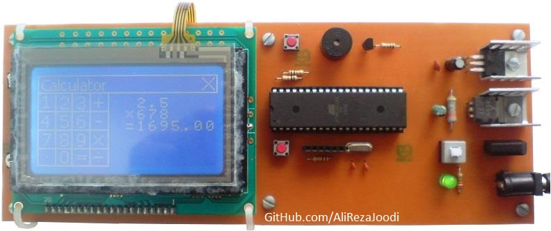
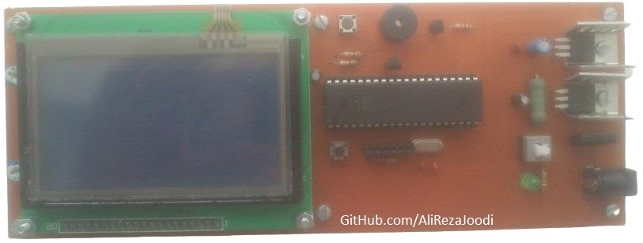
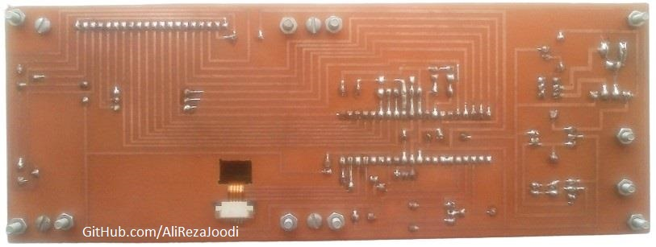

## Calculator with GLCD Display and TouchScreen, Thermometer with LM35 Sensor	   

MCU:		ATmega32A     
Display:	128*64 KS108 GLCD   
Touch:		Resistive Touch Screen  
Sensor:     	LM35  

Note: Included schematic and PCB layout with Proteus  
Note: It's a prototype and should get better 

### Folder and Files Description
It has included:
- `Code_BascomAVR` (Code with Basic Language)
- `Hardware` (Included hardware laye
- `Pictures` (Photos Samples Made)
- `Simulate` (Simulator File)

### Pictures: v1.0

### Pictures: v2.0

### Pictures: v2.0, Bottom

### Schematic: v1.0

My GitHub Account: [GitHub.com/AliRezaJoodi](https://github.com/AliRezaJoodi)  
**Note**: [You can go here to download a single folder or file from GitHub.com](https://minhaskamal.github.io/DownGit/#/home)
