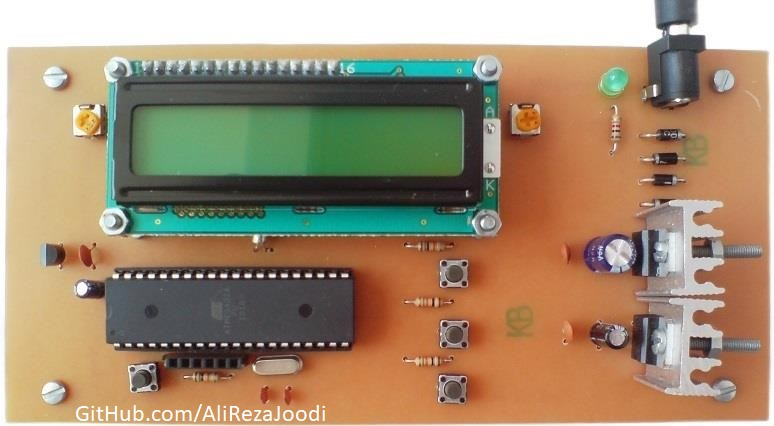
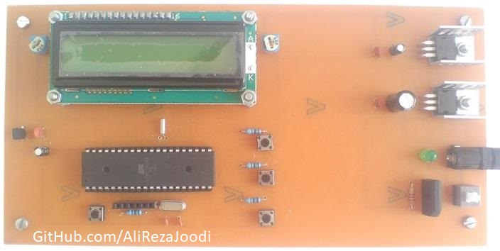
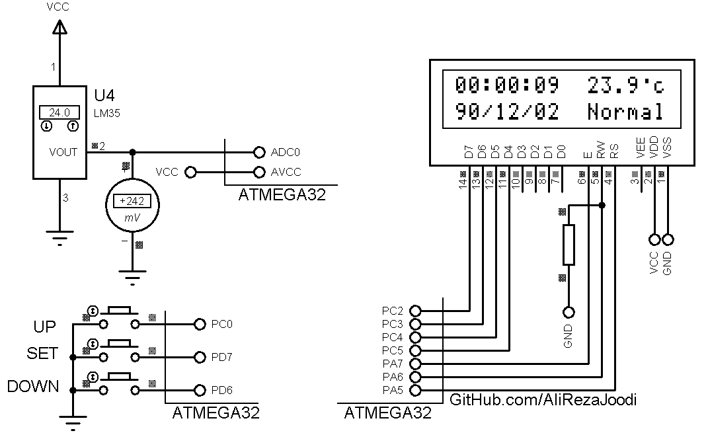

## Clock With Internal Timer And Thermometer On LCD Display
  
MCU:        ATmega32  
Frequency:  8MHz  
Display:    16x2 Character LCD  
Sensor:     LM35     

Note: Included schematic and PCB layout with Proteus  
Note: It's a prototype and should get better 

### Folder and Files Description
It has included:
- `Code_BascomAVR` (Code with Basic Language)
- `Hardware` (Included hardware laye)
- `Pictures` (Photos Samples Made)
- `Simulate` (Simulator File)

### Pictures: v1.0

### Pictures: v1.1

### Schematic: v1.1

### Simulate: v1.0

My GitHub Account: [GitHub.com/AliRezaJoodi](https://github.com/AliRezaJoodi)  
**Note**: [You can go here to download a single folder or file from GitHub.com](https://minhaskamal.github.io/DownGit/#/home)
