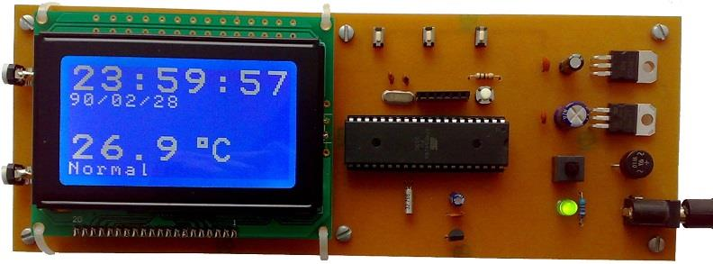
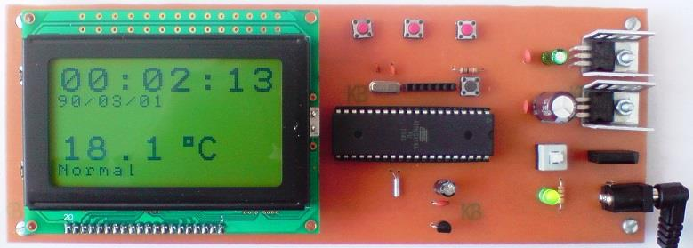

## Clock With Internal Timer And Thermometer On GLCD Display
  
MCU:        	ATmega16  
Frequency:  	8MHz  
Display:	128*64 KS108 GLCD  
Timer: 		Internal Timer (Timer2)    
Sensor:     	LM35     

Note: Included simulator, schematic and PCB layout with Proteus.  
Note: It's a prototype and should get better. 
Note: It's not usable because when the MCU resets the clock value will be lost.  

### Folder and Files Description
It has included:
- `Code_BascomAVR` (Code with Basic Language)
- `Hardware` (Included hardware laye)
- `Pictures` (Photos Samples Made)
- `Simulate` (Simulator File)

### Picture: v1.0
  

### Schematic: v1.0

My GitHub Account: [GitHub.com/AliRezaJoodi](https://github.com/AliRezaJoodi)  
**Note**: [You can go here to download a single folder or file from GitHub.com](https://minhaskamal.github.io/DownGit/#/home)
