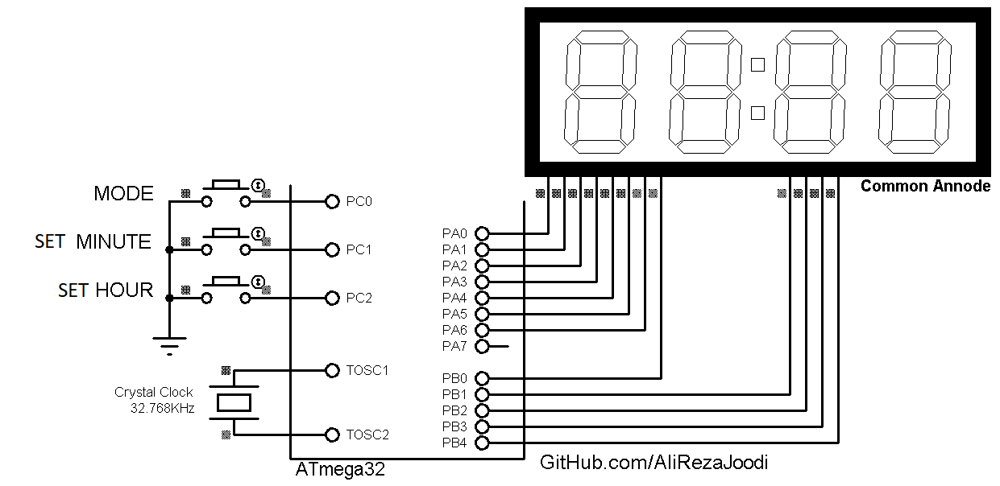

## Digital Clock With 7 Segment Display
  
MCU:        ATmega32  
Frequency:  8MHz  
Display:    4-Digit 7-Segment  

Note: It use of the Timer2 in asynchronous mode  
Note: It's a practice and no good for use  

### Folder and Files Description
It has included:
- `Code_BascomAVR` (Code with Basic Language)
- `Code_CodeVisionAVR` (Code with C Language)
- `Simulate` (Simulator File)

### Simulate: v1.0

My GitHub Account: [GitHub.com/AliRezaJoodi](https://github.com/AliRezaJoodi)  
**Note**: [You can go here to download a single folder or file from GitHub.com](https://minhaskamal.github.io/DownGit/#/home)
