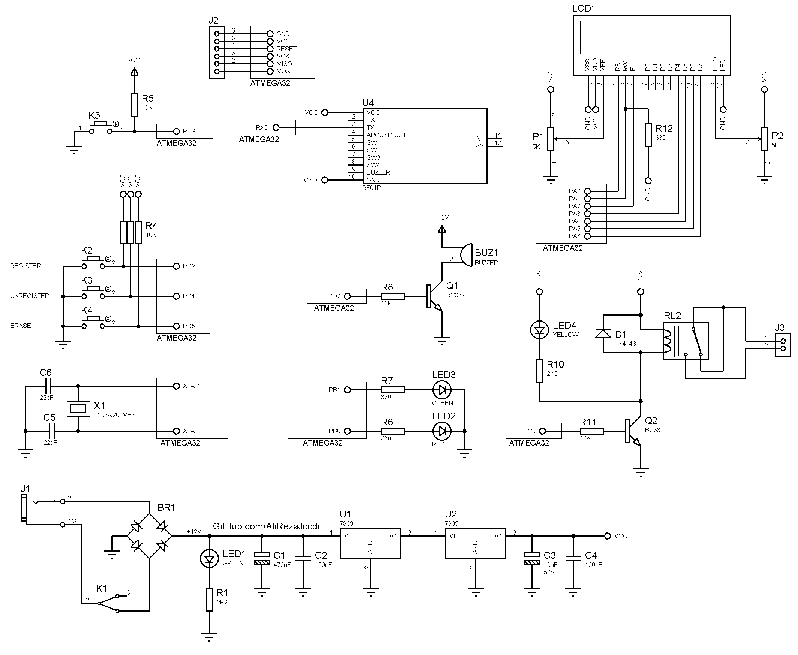

## RFID Code Lock with 125KHz Tag and LCD Display

MCU:		ATmega32A  
Display:    	16x2 Character LCD  
    
Note: `RF01D_ID3` module is only available in the Iranian market. I don't know, Is there like the module in other country?  
Note: Included schematic and PCB layout with Proteus  
Note: It's a prototype and should get better 

### Folder and Files Description
It has included:
- `Code_BascomAVR` (Code with Basic Language)
- `Hardware` (Included hardware laye
- `Pictures` (Photos Samples Made)

### Pictures: v1.0

### Schematic: v1.1

My GitHub Account: [GitHub.com/AliRezaJoodi](https://github.com/AliRezaJoodi)  
**Note**: [You can go here to download a single folder or file from GitHub.com](https://minhaskamal.github.io/DownGit/#/home)
