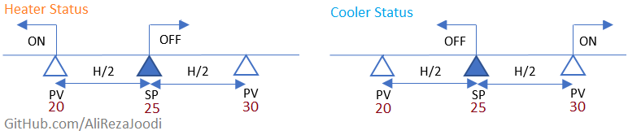
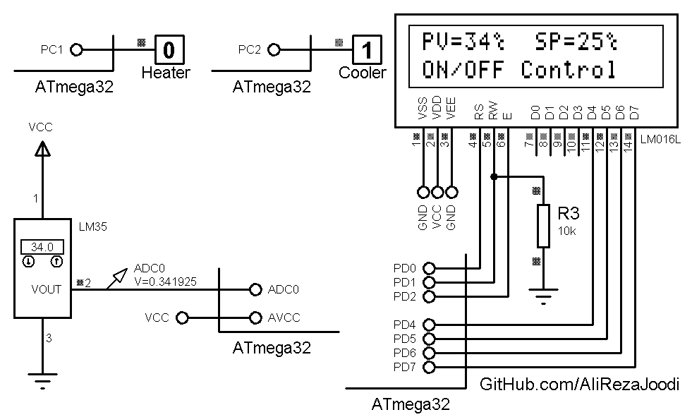

## ON/OFF Control Systems
It's a ON/OFF Temperature Controller.  
The outputs of this system are a heater and a cooler.  
It's an example for practice. So, We use constant value for the `setpoint` and `hysteresis` variables.  
The value of these variables are:  
``` c
sp=25;
hystersis=10;
```
Outputs Description:  


MCU:        ATmega32  
Frequency:  1.000000 MHz  
Display:    16x2 Character LCD  
Sensor:     LM35   

Note: `ControlSystem_OnOff.h` is a header file for ON/OFF control system functions. It usable for other uses.

### Folder and Files Description
It has included:
- `Code_CodeVisionAVR` (Code with C Language)
- `Simulate` (Simulator File)

### Simulate: v1.0


My GitHub Account: [GitHub.com/AliRezaJoodi](https://github.com/AliRezaJoodi)  
**Note**: [You can go here to download a single folder or file from GitHub.com](https://minhaskamal.github.io/DownGit/#/home)
