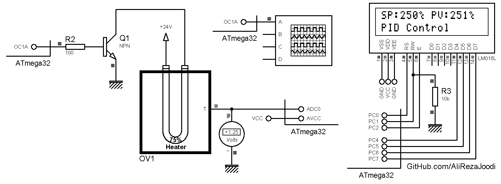

## PID Control Systems
It's a PID Temperature Controller for a oven.   
It's an example for practice. So, We use constant value for the `setpoint` variables.  

MCU:        ATmega32  
Frequency:  8.000000 MHz  
Display:    16x2 Character LCD   

### Folder and Files Description
It has included:
- `Code_CodeVisionAVR` (Code with C Language)
- `Simulate` (Simulator File)

### Simulate: v1.0

My GitHub Account: [GitHub.com/AliRezaJoodi](https://github.com/AliRezaJoodi)  
**Note**: [You can go here to download a single folder or file from GitHub.com](https://minhaskamal.github.io/DownGit/#/home)
