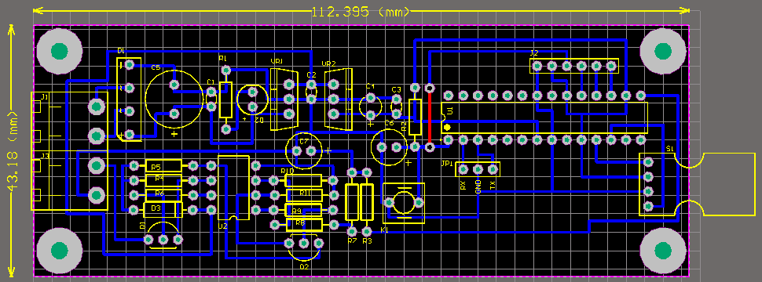
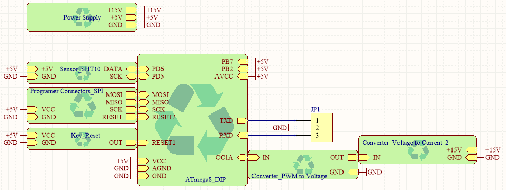

## Humidity to 4-20mA Conversion

MCU:        	ATmega32  
Sensor:     	SHT10  
Output:		4-20mA

Note: schematic and PCB layout with Proteus.  
Note: It's a prototype and should get better.  

### Folder and Files Description
It has included:
- `Code_CodeVisionAVR` (Code with C Language)
- `Hardware` (Included hardware laye)
- `Pictures` (Photos Samples Made)
- `Simulate` (Simulator File)

### Pictures: v1.0

### Schematic: v1.0

My GitHub Account: [GitHub.com/AliRezaJoodi](https://github.com/AliRezaJoodi)  
**Note**: [You can go here to download a single folder or file from GitHub.com](https://minhaskamal.github.io/DownGit/#/home)
