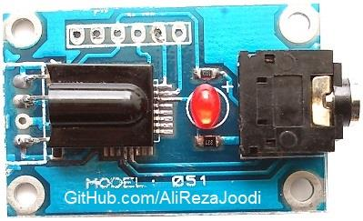
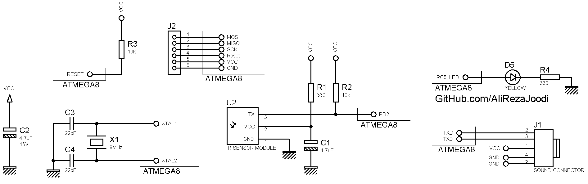

## Converter, IR to UART
Note: This is just a prototype and needs improvement.  
Note: The current firmware supports RC5 remotes only.  

### Pictures
v1.0  

### Features
- **Input Type:** IR, RC5
- **Output Type:** UART

### Folders and Files
This project includes:
- `Code_BascomAVR` — Microcontroller programmed in BASCOM-AVR (BASIC)
- `Hardware` — Schematic and PCB layout with Proteus
- `Pictures` — Project photos

### Schematic
v1.0  

### More Information
**Note**: [You can go here to download a single folder or file from GitHub.com](https://minhaskamal.github.io/DownGit/#/home)  
My GitHub Account: [GitHub.com/AliRezaJoodi](https://github.com/AliRezaJoodi)  
