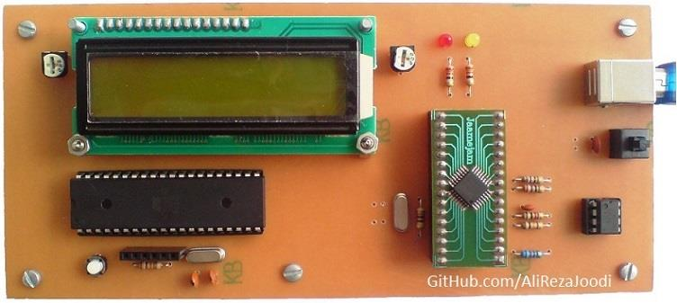
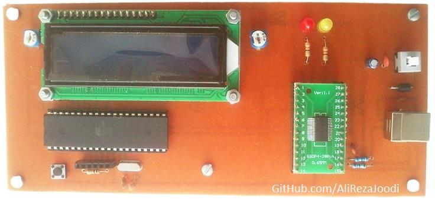
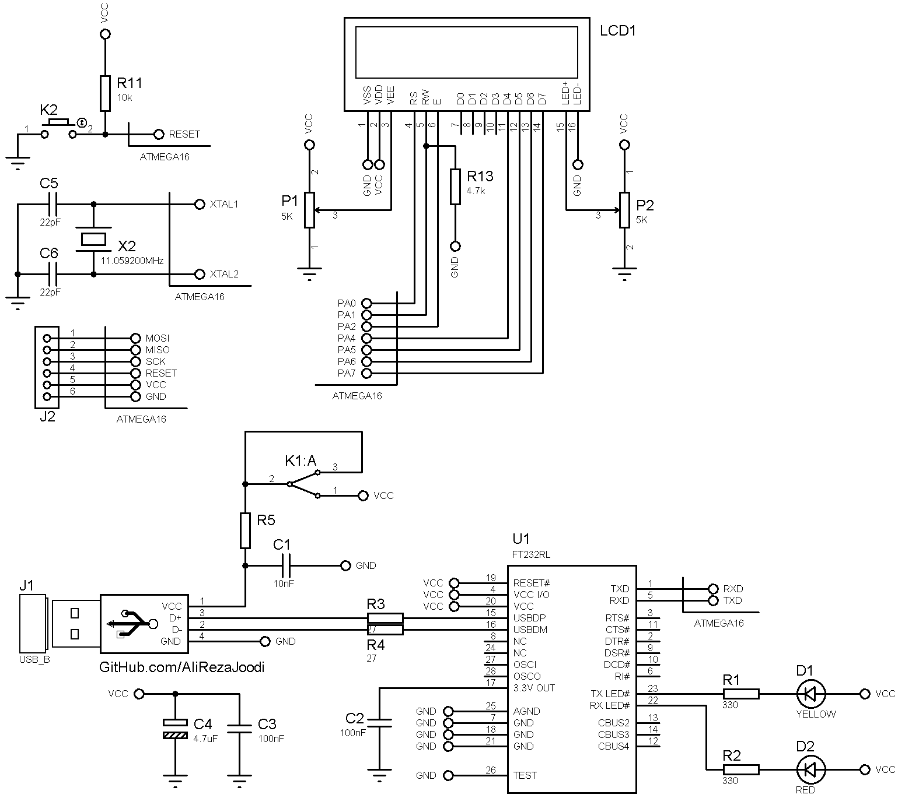

## Text Display With 16*2 LCD and Controlled By Computer

Frame format is
|Line Command|Text|End Chr|Description|
|:-----------|:---|:------|:----------|
|'1'|"Hello World"|13|Display `Hello World` on the first line|
|'2'|"Hello World"|13|Display `Hello World` on the second line|
	   
MCU:			ATmega32A  
Frequency:     		11.059200MHz (External Crystal)   
Display:        	16x2 LCD        
Computer Interfacing:	UART to USB Converter with FT232BL and FT232RL 
Computer Software:	VB6	

Note: Included schematic and PCB layout with Proteus  
Note: It's a prototype and should get better

### Folder and Files Description
It has included:
- `Code_BascomAVR` (Code with Basic Language)
- `Code_CodeVisionAVR` (Code with C Language)
- `Code_VB6` (Software with Visual Basic)
- `Hardware_USB_FT232BL` (Included hardware laye)
- `Hardware_USB_FT232RL` (Included hardware laye)
- `Pictures` (Photos Samples Made)
- `Simulate` (Simulator File)

### Picture, USB Controller with FT232BL: v1.0

### Picture, USB Controller with FT232RL: v1.0

### Software: v1.0

### Schematic, USB Controller with FT232RL: v1.0

My GitHub Account: [GitHub.com/AliRezaJoodi](https://github.com/AliRezaJoodi)  
**Note**: [You can go here to download a single folder or file from GitHub.com](https://minhaskamal.github.io/DownGit/#/home)
