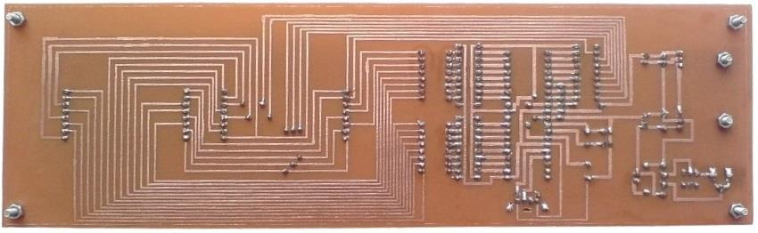

## Display With 8x16 LED

MCU:		ATmega32A  

Note: Model 1 with 8x16 LED
Note: Model 2 with 8x16 Dot Matrix

Note: The text changeable with a PS2 keyboard
Note: Included simulator, schematic and PCB layout with Proteus  
Note: It's a prototype and should get better 

### Folder and Files Description
It has included:
- `Code_BascomAVR` (Code with Basic Language)
- `Hardware` (Included hardware laye
- `Pictures` (Photos Samples Made)
- `Simulate` (Simulator File)

### Pictures: Model1, v2.0

### Pictures: Model2, v1.0

### Pictures: Model2, v1.0, Bottom

### Schematic: Model1, v2.0

My GitHub Account: [GitHub.com/AliRezaJoodi](https://github.com/AliRezaJoodi)  
**Note**: [You can go here to download a single folder or file from GitHub.com](https://minhaskamal.github.io/DownGit/#/home)
