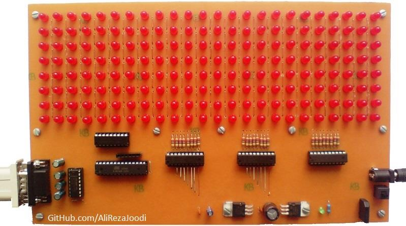
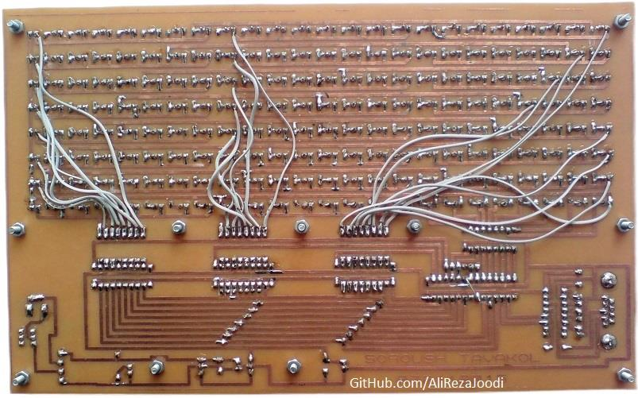
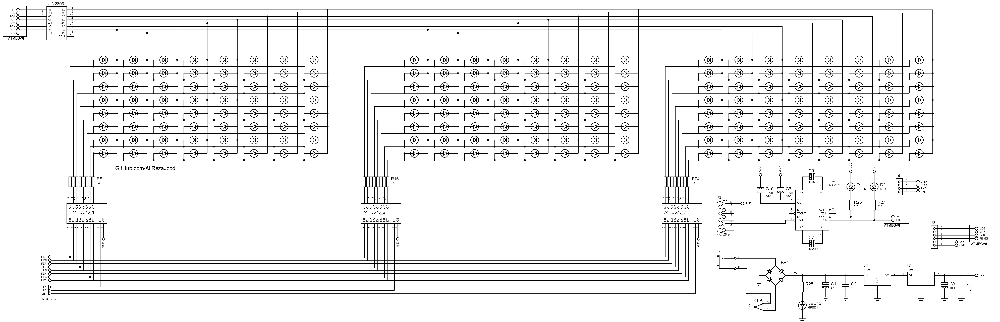

## Display With 8x24 LED

MCU:		ATmega8A  

Note: The text changeable with RS232
Note: Included simulator, schematic and PCB layout with Proteus  
Note: It's a prototype and should get better 

### Folder and Files Description
It has included:
- `Code_BascomAVR` (Code with Basic Language)
- `Code_CodeVisionAVR` (Code with C Language). Need to check.
- `Code_VB6` (Software with Visual Basic). Need to check.
- `Hardware` (Included hardware laye
- `Pictures` (Photos Samples Made)
- `Simulate` (Simulator File)

### Pictures: v2.0

### Pictures: v2.0, Bottom

### Schematic: v2.0

My GitHub Account: [GitHub.com/AliRezaJoodi](https://github.com/AliRezaJoodi)  
**Note**: [You can go here to download a single folder or file from GitHub.com](https://minhaskamal.github.io/DownGit/#/home)
