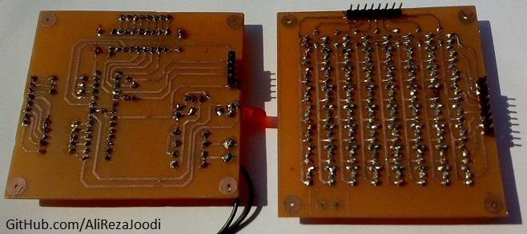

## Display With 8x8 LED

MCU:		ATmega32A  

Note: Included schematic and PCB layout with Proteus  
Note: It's a prototype and should get better 

### Folder and Files Description
It has included:
- `Code_BascomAVR` (Code with Basic Language)
- `Hardware` (Included hardware laye
- `Pictures` (Photos Samples Made)
- `Simulate` (Simulator File)

### Pictures: v4.1

### Pictures: v4.1, Bottom

### Pictures: v4.0

### Pictures: v3.1

### Pictures: v3.0

### Pictures: v1.0

### Pictures: v1.0, Top

### Pictures: v1.0, Bottom

### Schematic: v4.0

My GitHub Account: [GitHub.com/AliRezaJoodi](https://github.com/AliRezaJoodi)  
**Note**: [You can go here to download a single folder or file from GitHub.com](https://minhaskamal.github.io/DownGit/#/home)
