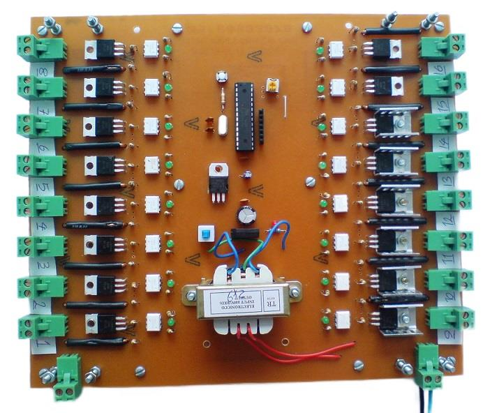
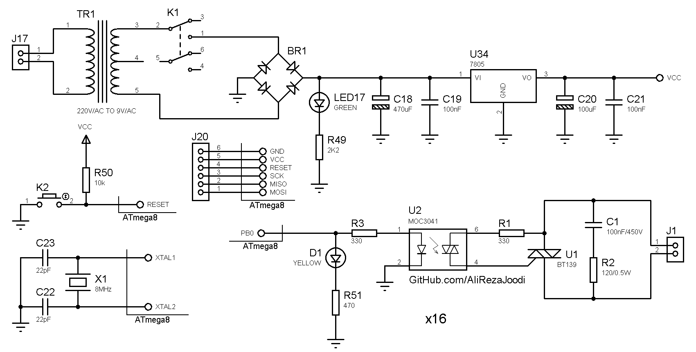

## 16CH Flashing Light with Triacs

MCU:			ATmega8  
Frequency:     		8MHz  

Note: Included schematic and PCB layout with Proteus    
Note: It's a prototype and should get better.  

### Folder and Files Description
It has included:
- `Code_BascomAVR` (Code with Basic Language)
- `Hardware` (Included hardware layers)
- `Pictures` (Photos Samples Made)

### Pictures: v1.0

### Schematic: v1.1

### Video: v1.0
[Youtube.com/@AliRezaJoodi](https://www.youtube.com/watch?v=kVtlkroPYHs) 

My GitHub Account: [GitHub.com/AliRezaJoodi](https://github.com/AliRezaJoodi)  
**Note**: [You can go here to download a single folder or file from GitHub.com](https://minhaskamal.github.io/DownGit/#/home)
