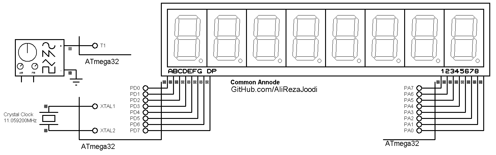

## Frequency Meter with 7Segment Display

MCU:        ATmega32  
Frequency:  11.059200 MHz (External)  
Timer0:     Config in Timer Mode  
Timer1:     Config in Counter Mode  
Display:    8-Digit 7-Segment  

### Folder and Files Description
It has included:
- `Code_BascomAVR` (Code with Basic Language)
- `Simulate` (Simulator File)

### Simulate: v1.0

My GitHub Account: [GitHub.com/AliRezaJoodi](https://github.com/AliRezaJoodi)  
**Note**: [You can go here to download a single folder or file from GitHub.com](https://minhaskamal.github.io/DownGit/#/home)
