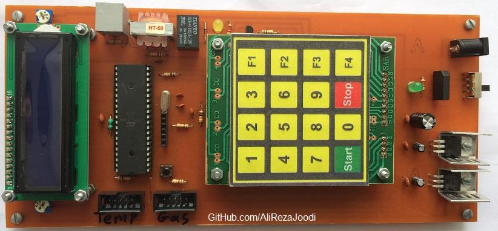
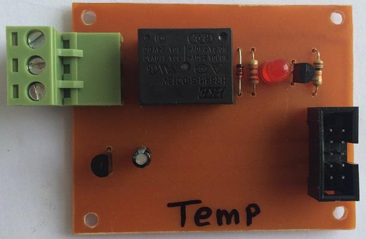

## Gas Detector and Temperature with Dial
Note: This is just a prototype and needs improvement.  
Note: Usable for MQ series sensors except MQ-7 and MQ-9 .  

### Photo
v1.0, Main  

v1.0, Gas Panel  

v1.0, Temp Panel  

### Features
- **Gas Sensor Type:** MQ Series Gas Sensor x1
- **Temperature Sensor Type:** LM35 x1
- **Alarm Type:** Buzzer, Relay, Dial
- **Display:** 16x2 Character LCD
- **Output Type:** Relay x1
- **Input Type:** 4x4 Keypad
- **Microcontroller:** ATmega32A
- **Power Supply for Main Board:** 9V/1A Adapter

### Folders
- `Code_BascomAVR` — Microcontroller programmed in BASCOM-AVR (BASIC)
- `Hardware` — Schematic and PCB layout
- `Pictures` — Project photos
- `Simulate` — Simulating the project with Proteus

### Schematic
v1.0, Main  

v1.0, Panel, Gas  

v1.0, Panel,Temp  

### More Information
**Note**: [You can go here to download a single folder or file from GitHub.com](https://minhaskamal.github.io/DownGit/#/home)  
My GitHub Account: [GitHub.com/AliRezaJoodi](https://github.com/AliRezaJoodi)  
