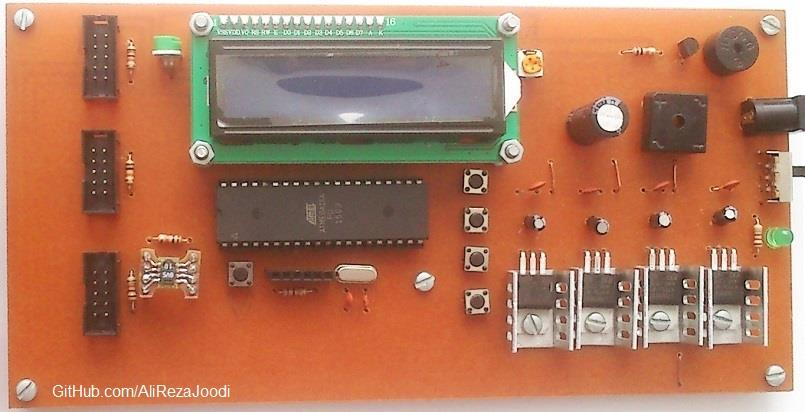
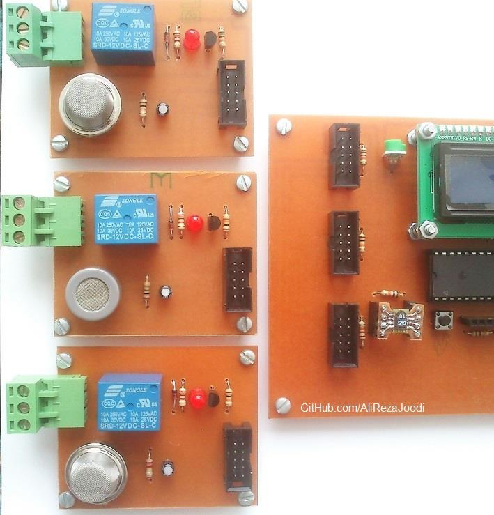

## Gas Detector and Humidity Sensor, 3-Zone
Note: This is just a prototype and needs improvement.  
Note: Usable for MQ series sensors, except MQ-7 and MQ-9.  

### Photo
v1.0  
  
  

### Features
- **Gas Sensor Type:** MQ Series Gas Sensor x3
- **Humidity Sensor Type:** SHT10
- **Alarm Type:** Buzzer, Relay
- **Display:** 16x2 Character LCD
- **Output Type:** Relay x3
- **Microcontroller:** ATmega32A
- **Power Supply for Main Board:** 9V/2A Adapter

### Folders
- `Code_BascomAVR` — Microcontroller programmed in BASCOM-AVR (BASIC)
- `Hardware` — Schematic and PCB layout with Proteus
- `Pictures` — Project photos
- `Simulate` — Simulating the project with Proteus

### Schematic
v1.0, Main  

v1.0, Panel  

### More Information
**Note**: [You can go here to download a single folder or file from GitHub.com](https://minhaskamal.github.io/DownGit/#/home)  
My GitHub Account: [GitHub.com/AliRezaJoodi](https://github.com/AliRezaJoodi)  
