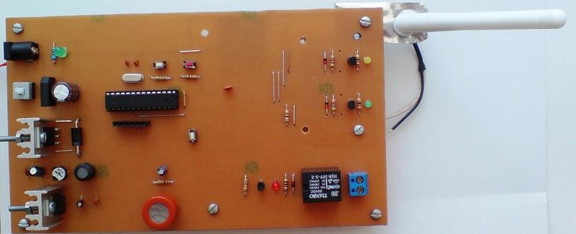

## Gas Detector with Alarm Using GSM
Note: This is just a prototype and needs improvement.  
Note: Usable for MQ series sensors except MQ-7 and MQ-9 .  

### Photo
v1.0
  

### Features
- **Gas Sensor Type:** MQ Series Gas Sensor
- **GSM Type:** SIM300CZ
- **Alarm Type:** Relay, Dial
- **Output Type:** Relay x1
- **Microcontroller:** ATmega8A
- **Power Supply for Main Board:** 9V/2A Adapter

### Folders
- `Code_BascomAVR` — Microcontroller programmed in BASCOM-AVR (BASIC)
- `Hardware` — Schematic and PCB layout with Proteus
- `Pictures` — Project photos

### Schematic
v1.0 

### More Information
**Note**: [You can go here to download a single folder or file from GitHub.com](https://minhaskamal.github.io/DownGit/#/home)  
My GitHub Account: [GitHub.com/AliRezaJoodi](https://github.com/AliRezaJoodi)  
