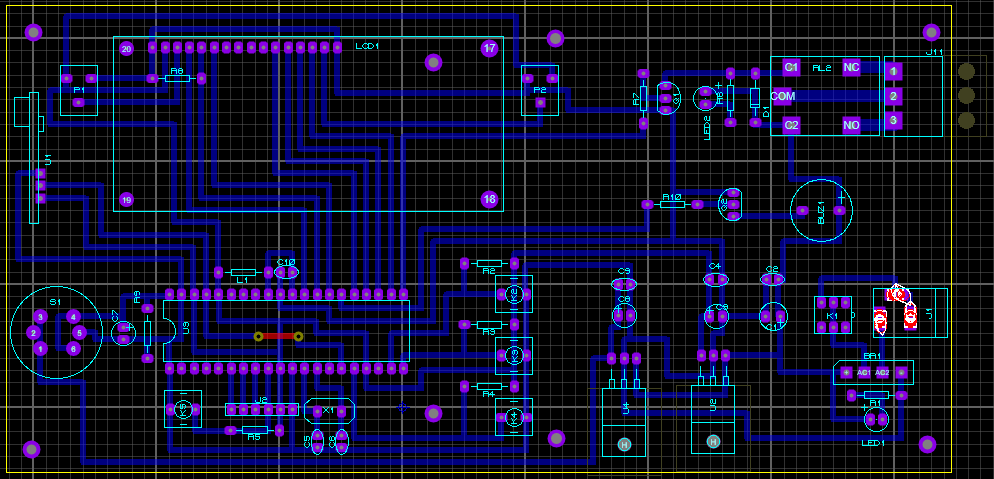
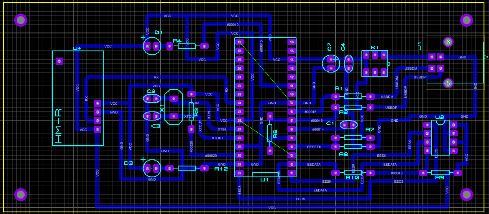
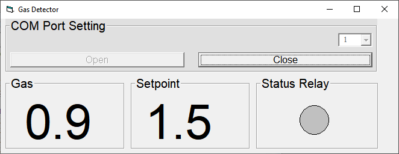
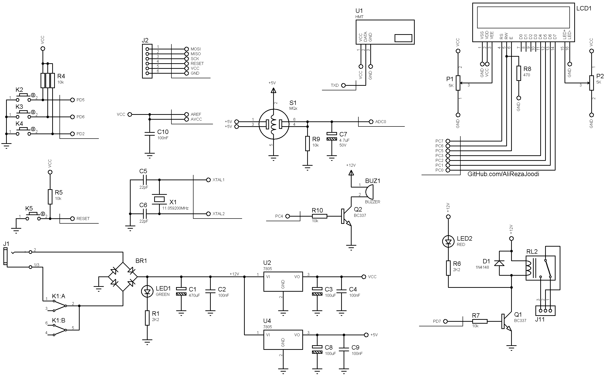
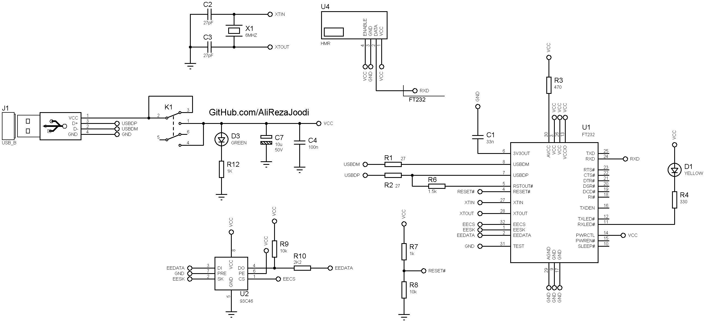

## Wireless Gas Detector with Computer Monitoring
Note: This is just a prototype and needs improvement.  
Note: Usable for MQ series sensors except MQ-7 and MQ-9 .  

### Photo
Transmitter, v1.0, PCB  

Receiver, v1.0, PCB   

Software, VB6, v1.0  

### Features
- **Gas Sensor Type:** MQ Series Gas Sensor
- **Communication Method:** Wireless, FSK RF Module
- **RF Module:** HMR and HMT Module
- **Display:** 16x2 Character LCD
- **Output Type:** Relay x1
- **Computer Interface:** USB to UART converter, FT232BL
- **Microcontroller:** ATmega32A
- **Power Supply for Main Board:** 9V/1A Adapter
- **Power Supply for Receiver:** USB Powered

### Folders
- `Code_BascomAVR` — Microcontroller programmed in BASCOM-AVR (BASIC)
- `Code_VB6` — Software developed in VB6 (BASIC)
- `Hardware` — Schematic and PCB layout with Proteus

### Schematic
Transmitter, v1.0  

Receiver_v1.0  

### More Information
**Note**: [You can go here to download a single folder or file from GitHub.com](https://minhaskamal.github.io/DownGit/#/home)  
My GitHub Account: [GitHub.com/AliRezaJoodi](https://github.com/AliRezaJoodi)  
