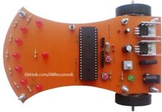
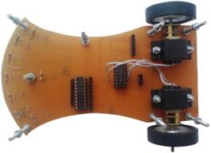

## Line Follower Robot

MCU:		ATmega32A  
Frequency:     	11.059200MHz (External Crystal)  
DC Motor:	Mini Geared DC Motor, 6V, 60RPM ~ 200RPM  
Wheel:		40mm Diameter 3mm Hole Size Aluminum Robot Wheel  
Ball Caster:	8mm Diameter Ball Caster Wheel  

Note: Included schematic and PCB layout with Proteus  
Note: It's a prototype and should get better 

### Folder and Files Description
It has included:
- `Code_BascomAVR` (Code with Basic Language)
- `Code_CodeVisionAVR` (Code with C Language)
- `Hardware` (Included hardware laye

### Pictures: v1.0

### Top Board Schematic: v1.0

### Bottom Board Schematic: v1.0

### More Pictures: v1.0

My GitHub Account: [GitHub.com/AliRezaJoodi](https://github.com/AliRezaJoodi)  
**Note**: [You can go here to download a single folder or file from GitHub.com](https://minhaskamal.github.io/DownGit/#/home)
