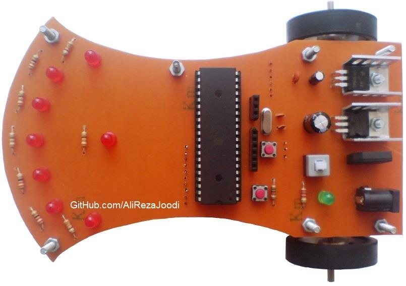
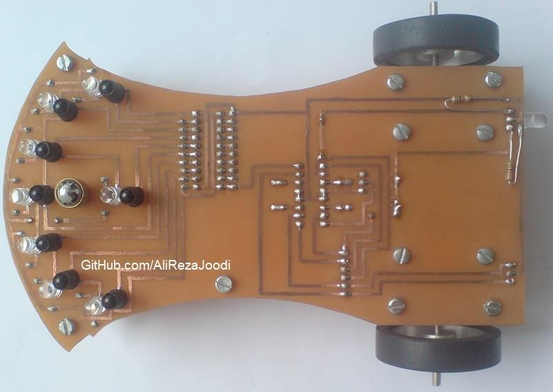
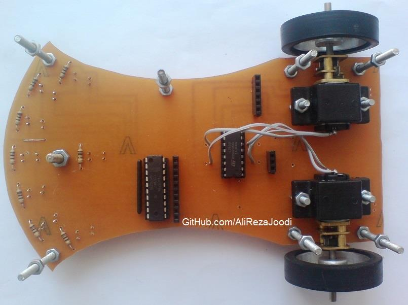
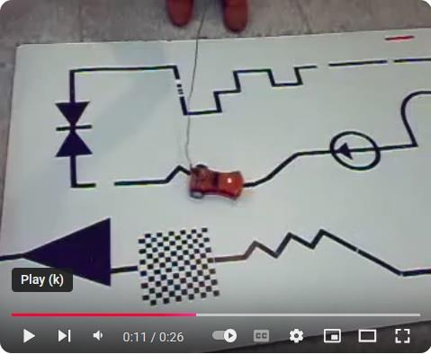

## Line Follower Robot
Note: This is just a prototype and needs improvement.

### Pictures
v1.0  

### Features
- **Motor Type:** Mini Geared DC Motor, 6V, 60RPM ~ 200RPM
- **Wheel Type:** 40mm Diameter 3mm Hole Size Aluminum Robot Wheel
- **Ball Caster Type:** 8mm Diameter Ball Caster Wheel
- **Microcontroller:** ATmega32A
- **Motor Driver:** L293 based 

### Folders and Files
This project includes:
- `Code_BascomAVR` — Microcontroller programmed in BASCOM-AVR (BASIC)
- `Code_CodeVisionAVR` — Microcontroller programmed in CodeVisionAVR (C)
- `Hardware` — Schematic and PCB layout with Proteus
- `Pictures` — Project photos

### Schematic
Top Board: v1.0  

Bottom Board: v1.0  

### More Pictures
  
  
  

### Video
v1.0  

   

### More Information
**Note**: [You can go here to download a single folder or file from GitHub.com](https://minhaskamal.github.io/DownGit/#/home)  
My GitHub Account: [GitHub.com/AliRezaJoodi](https://github.com/AliRezaJoodi) 