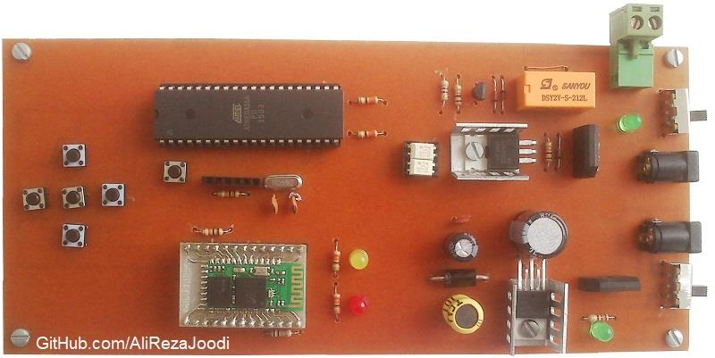

## DC Motor Driver, Speed and Direction Controller with Bluetooth from Computer/Mobile

MCU:			ATmega32A  
Driver: 		Mosfet for Speed Controller  
Driver:			Relay for Direction Controller  
Bluetooth module:	HC-05  

Note: Included schematic and PCB layout with Proteus  
Note: It's a prototype and should get better 

Commands:
Anti-Clockwise:	"L"
Clockwise:	"R"
Stop:		"S"
Increase Speed:	"U"
Decrease Speed:"D"

### Folder and Files Description
It has included:
- `Code_BascomAVR` (Code with Basic Language)
- `Hardware` (Included hardware laye
- `Pictures` (Photos Samples Made)

### Picture: v1.0

### Schematic: v1.0

My GitHub Account: [GitHub.com/AliRezaJoodi](https://github.com/AliRezaJoodi)  
**Note**: [You can go here to download a single folder or file from GitHub.com](https://minhaskamal.github.io/DownGit/#/home)
