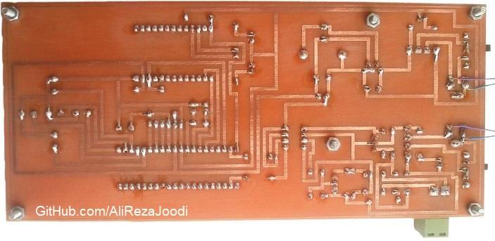
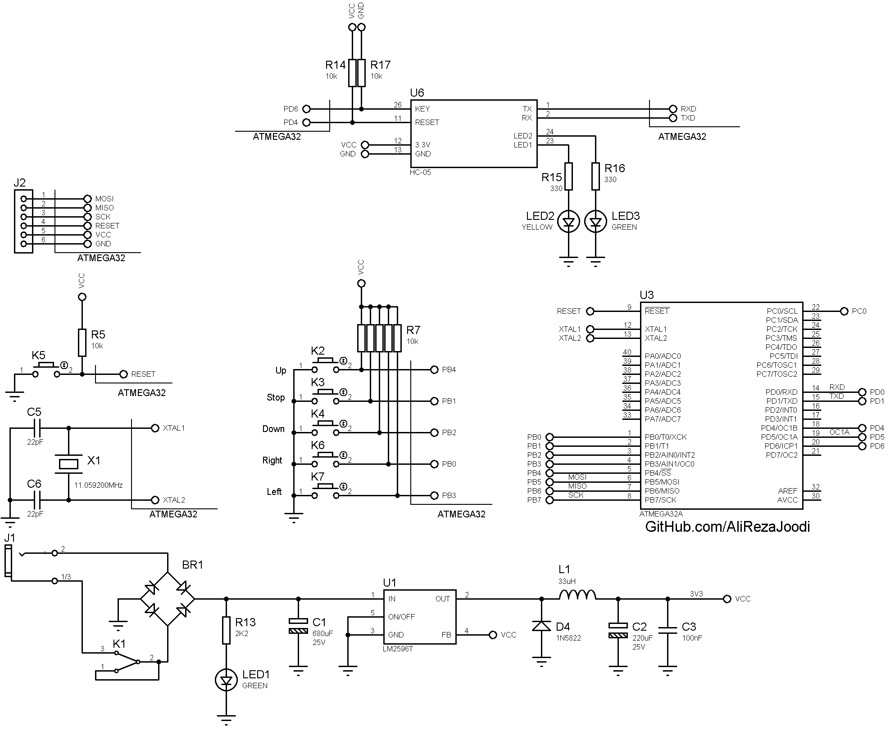

## DC Motor Driver, Speed and Direction Controller with Bluetooth from Computer/Mobile

MCU:			ATmega32A  
Driver: 		Mosfet for Speed Controller  
Driver:			Relay for Direction Controller  
Computer Interfacing:	Bluetooth  
Computer Software:	VB6  
Mobile (Android):	Blue Controller V2.0, ...   

Note: Included schematic and PCB layout with Proteus  
Note: It's a prototype and should get better 

### Folder and Files Description
It has included:
- `Code_BascomAVR` (Code with Basic Language)
- `Code_VB6` (Software with Visual Basic)
- `Hardware` (Included hardware laye
- `Pictures` (Photos Samples Made)

### Picture: v1.0

### Picture: v1.0, Bottom

### Software: v1.0

### Schematic: v1.0

My GitHub Account: [GitHub.com/AliRezaJoodi](https://github.com/AliRezaJoodi)  
**Note**: [You can go here to download a single folder or file from GitHub.com](https://minhaskamal.github.io/DownGit/#/home)
