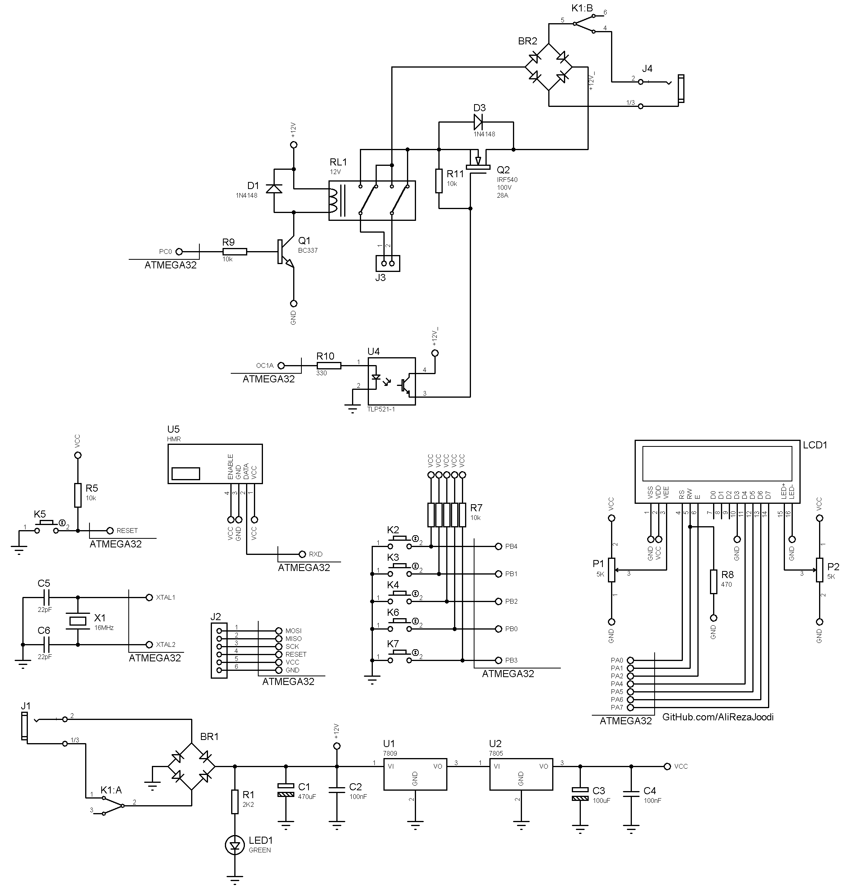

## DC Motor Driver, Speed and Direction Controller with FSK RF Module

MCU:		ATmega32A  
Display:        16x2 LCD  
Driver: 	Mosfet for Speed Controller  
Driver:		Relay for Direction Controller  
RF Module:	FSK  

Note: Included schematic and PCB layout with Proteus  
Note: It's a prototype and should get better 

### Folder and Files Description
It has included:
- `Code_BascomAVR` (Code with Basic Language)
- `Hardware` (Included hardware laye
- `Pictures` (Photos Samples Made)

### Pictures: Transmitter, v1.0

### Pictures: Receiver, v1.0

### PCB: Receiver, v1.0

### Schematic: Transmitter, v1.0

### Schematic: Receiver, v1.0

My GitHub Account: [GitHub.com/AliRezaJoodi](https://github.com/AliRezaJoodi)  
**Note**: [You can go here to download a single folder or file from GitHub.com](https://minhaskamal.github.io/DownGit/#/home)
