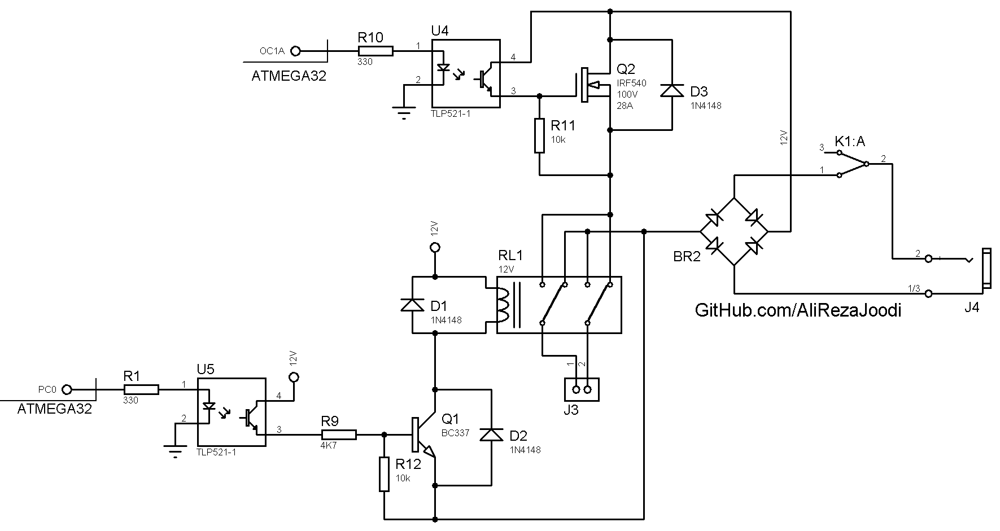

## DC Motor Driver, No Feedback, Computer Controlled, USB Interface
Note: This is just a prototype and needs improvement.

### Pictures
v1.0, Top  

v1.0, Bottom  

Software, VB6, v1.0  

### Features
- **Motor Type:** DC motor
- **Control Method 1:** Manual, 5 push buttons
- **Control Method 2:** Computer Controlled, USB Interface
- **Microcontroller:** ATmega32A
- **Display:** 16x2 Character LCD
- **Computer Interface:** USB to UART converter, FT232RL
- **Motor Speed Control:** MOSFET based driver
- **Motor Direction Control:** Relay based driver
- **Motor Driver Isolation:** TLP521 optocoupler for signal isolation
- **Power Supply for Controller:** USB powered  
- **Power Supply for Motor:** External adapter

### Folders and Files
This project includes:
- `Code_BascomAVR` — Microcontroller programmed in BASCOM-AVR (BASIC)
- `Code_VB6` — Software developed in Visual Basic 6.0 (BASIC)
- `Hardware` — Schematic and PCB layout with Proteus
- `Pictures` — Project photos

### Schematic
v1.0, Controller  

v1.0, Driver  

### More Information
 **Note**: [You can go here to download a single folder or file from GitHub.com](https://minhaskamal.github.io/DownGit/#/home)  
 My GitHub Account: [GitHub.com/AliRezaJoodi](https://github.com/AliRezaJoodi) 