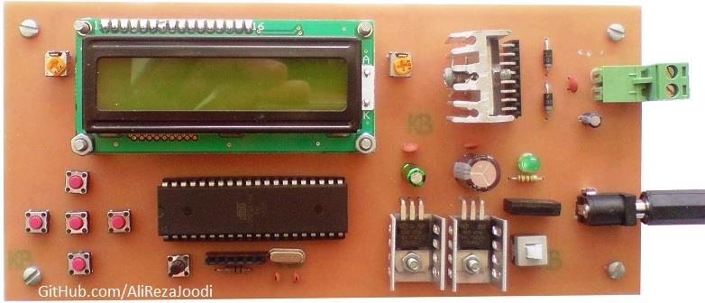
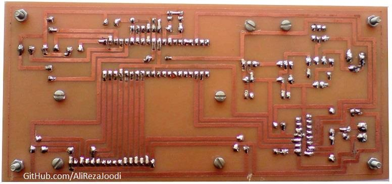
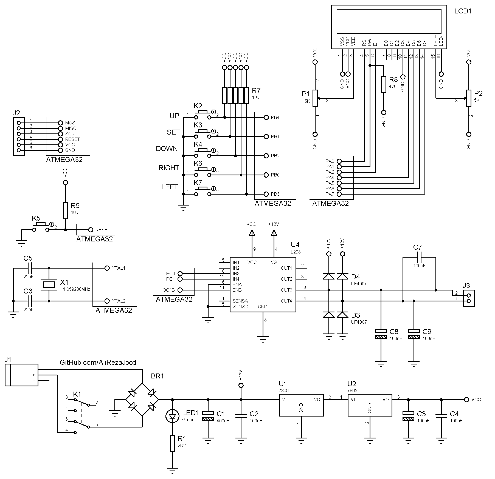

## DC Motor Driver, Manual Controlled, Driver Based on L298
Note: This is just a prototype and needs improvement.

### Pictures
v1.0, Top  

v1.0, Bottom  

### Features
- **Microcontroller:** ATmega32A 
- **Display:** 16x2 Character LCD
- **Motor Driver:** L298 based 
 
### Folders and Files
This project includes:
- `Code_BascomAVR` — Microcontroller programmed in BASCOM-AVR (BASIC)
- `Code_CodeVisionAVR` — Microcontroller programmed in CodeVisionAVR (C)
- `Hardware` — Schematic and PCB layout with Proteus
- `Pictures` — Project photos

### Schematic
v1.0  

### More Information
**Note**: [You can go here to download a single folder or file from GitHub.com](https://minhaskamal.github.io/DownGit/#/home)  
 My GitHub Account: [GitHub.com/AliRezaJoodi](https://github.com/AliRezaJoodi) 
