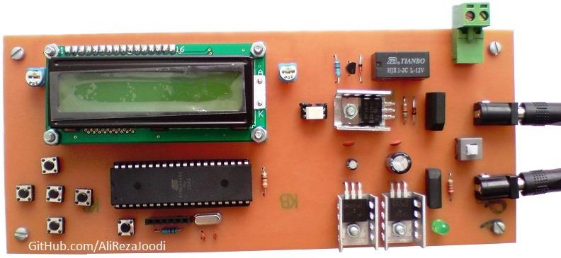
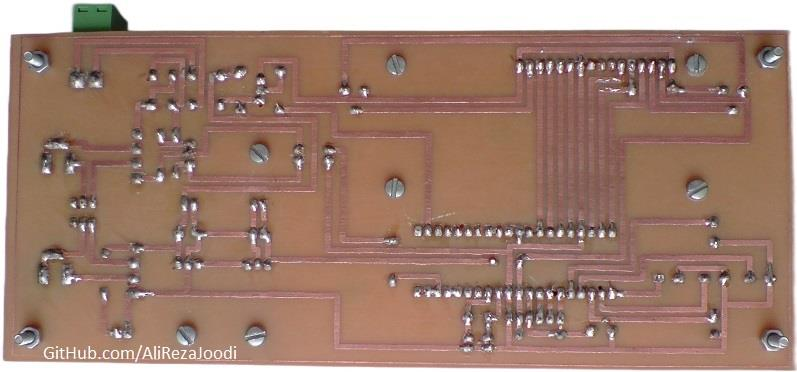
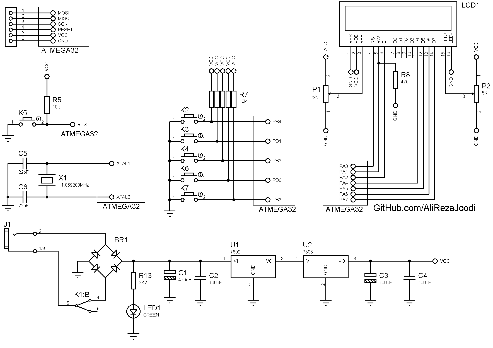
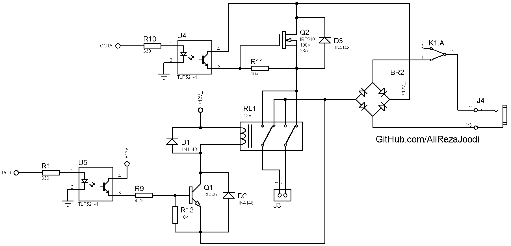

## DC Motor Driver, Manual Controlled, Driver Based on MOSFET
Note: This is just a prototype and needs improvement.

### Pictures
v1.0, Top  

v1.0, Bottom  

### Features
- **Motor Type:** DC motor
- **Control Method:** Manual, 5 push buttons
- **Microcontroller:** ATmega32A
- **Display:** 16x2 Character LCD
- **Motor Speed Control:** MOSFET based driver
- **Motor Direction Control:** Relay based driver
- **Motor Driver Isolation:** TLP521 optocoupler for signal isolation
- **Power Supply:** x2

### Folders and Files
This project includes:
- `Code_BascomAVR` — Microcontroller programmed in BASCOM-AVR (BASIC)
- `Hardware` — Schematic and PCB layout with Proteus
- `Pictures` — Project photos
- `Simulate` — Simulating the project with Proteus

### Schematic
v1.1, Controller  

v1.1, Driver  

### More Information
**Note**: [You can go here to download a single folder or file from GitHub.com](https://minhaskamal.github.io/DownGit/#/home)  
My GitHub Account: [GitHub.com/AliRezaJoodi](https://github.com/AliRezaJoodi)  

