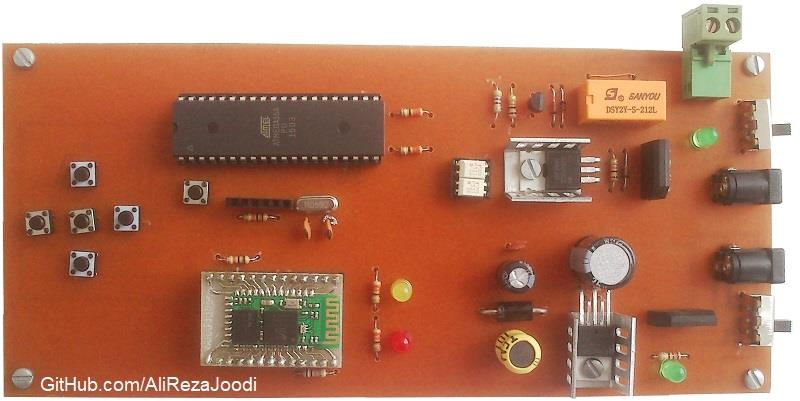
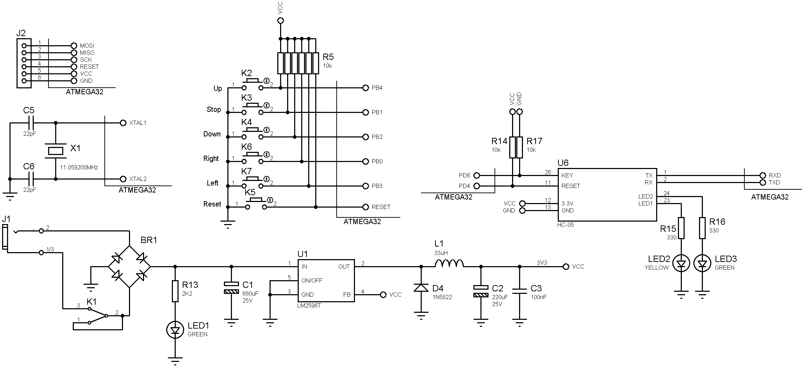
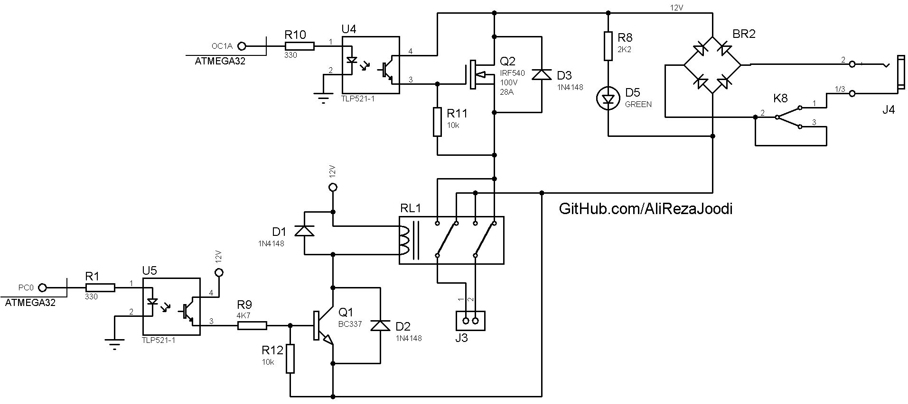

## DC Motor Driver, No Feedback, Remote Controlled, Bluetooth Interface
Note: This is just a prototype and needs improvement. 

### Pictures
v1.0  

### Features
- **Microcontroller:** ATmega32A
- **Bluetooth Module:** HC-05
- **Motor Speed Control:** MOSFET based driver
- **Motor Direction Control:** Relay based driver
- **Motor Driver Isolation:** TLP521 optocoupler for signal isolation
- **Power Supply**: x2

### Command Format 
Commands can be sent from any device with Bluetooth, like a computer or smartphone. 
- Anti-Clockwise: `L`  
- Clockwise: `R`  
- Stop: `S`  
- Increase Speed: `U`  
- Decrease Speed: `D`  

### Folders and Files
This project includes:
- `Code_BascomAVR` — Microcontroller programmed in BASCOM-AVR (BASIC)
- `Hardware` — Schematic and PCB layout with Proteus
- `Pictures` — Project photos

### Schematic
v1.0, Main  

v1.0, DC Motor Driver  

### More Information
**Note**: [You can go here to download a single folder or file from GitHub.com](https://minhaskamal.github.io/DownGit/#/home)  
My GitHub Account: [GitHub.com/AliRezaJoodi](https://github.com/AliRezaJoodi)  