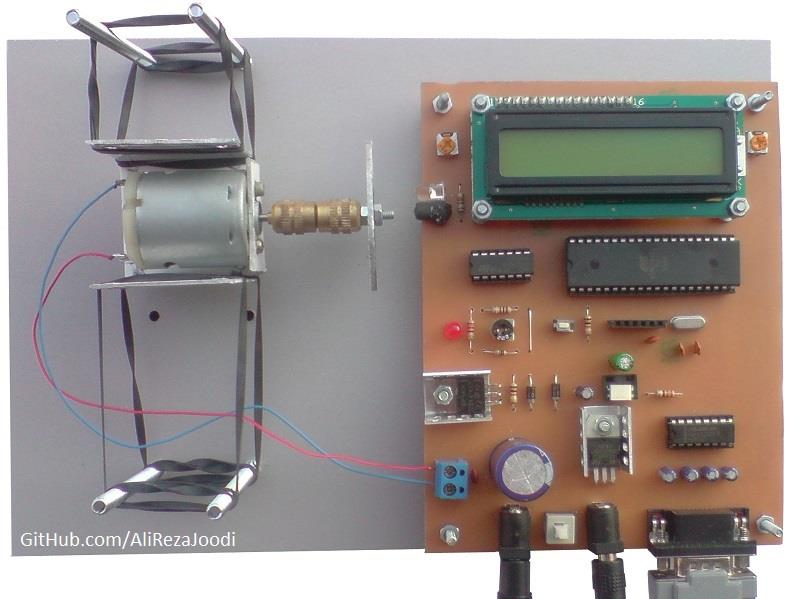
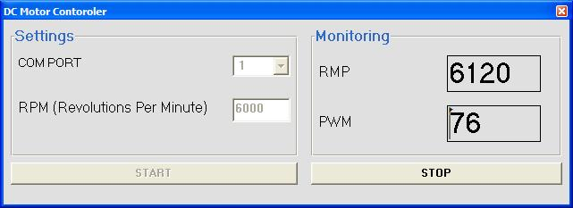
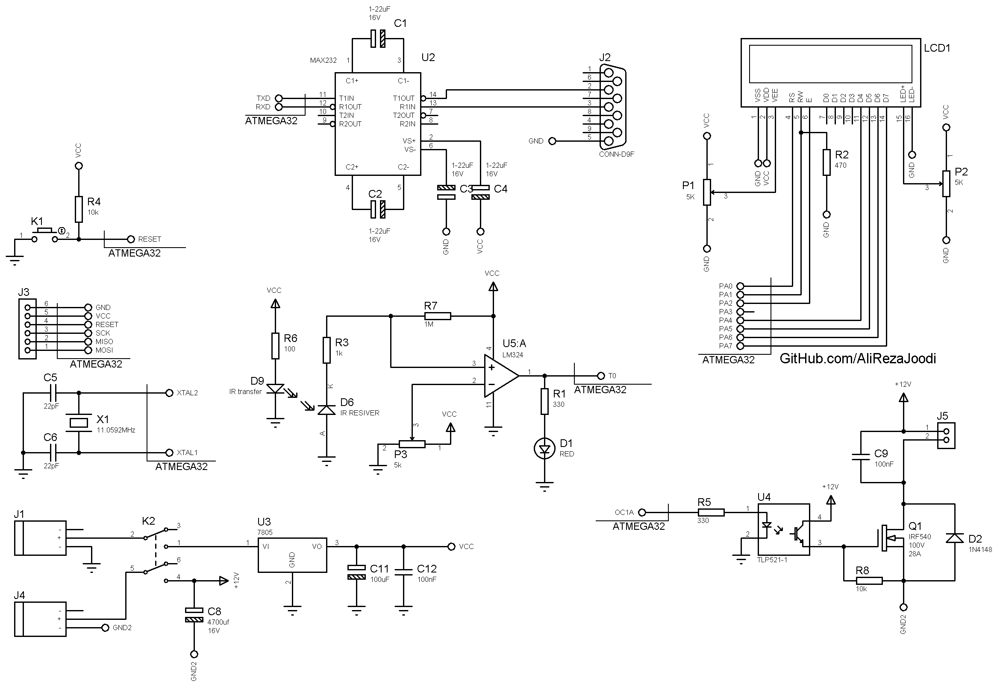

## DC Motor Driver, With Feedback, Computer Controlled
Note: This is just a prototype and needs improvement.

### Pictures
Hardware with RS232: v1.0  

Software with Visual Basic: v1.0  

### Features
- **Motor Type:** DC motor
- **Control Method 1:** Computer Controlled, USB Interface
- **Control Method 2:** Computer Controlled, RS232 Interface
- **Microcontroller:** ATmega32A
- **Display:** 16x2 Character LCD
- **Computer Interface:** R323 to UART converter, MAX232
- **Motor Speed Control:** MOSFET based driver
- **Motor Driver Isolation:** TLP521 optocoupler for signal isolation
- **Power Supply:** x2

### Folder and Files Description
It has included:
- `Code_BascomAVR_InputFromMatlab` — Microcontroller programmed in BASCOM-AVR (BASIC)
- `Code_BascomAVR_InputFromVB` — Microcontroller programmed in BASCOM-AVR (BASIC)
- `Code_Matlab` — Software developed in Matlab
- `Code_VB6` — Software developed in Visual Basic 6.0 (BASIC)
- `Hardware_FT232RL` — Schematic and PCB layout with Proteus
- `Hardware_MAX232` — Schematic and PCB layout with Proteus
- `Pictures` — Project photos

### Schematic
Hardware with RS232:v1.1  

### More Information
 **Note**: [You can go here to download a single folder or file from GitHub.com](https://minhaskamal.github.io/DownGit/#/home)  
 My GitHub Account: [GitHub.com/AliRezaJoodi](https://github.com/AliRezaJoodi) 