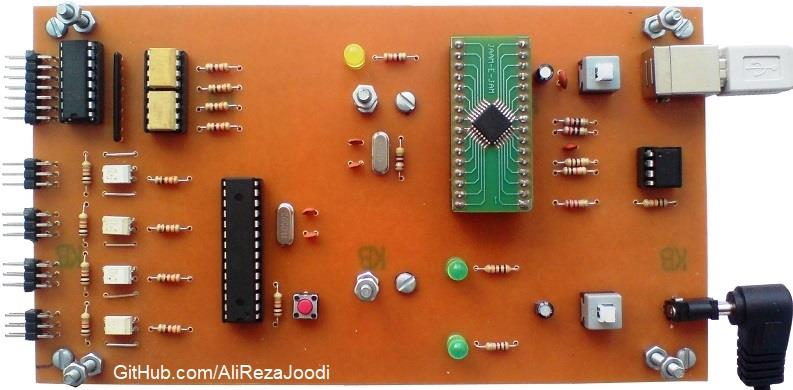

## Motor Driver, 4 Servo Motors and 1 Stepper Motor, Optically Isolated, Computer Controlled, USB Interface
	   
MCU:			ATmega32A    
Computer Interfacing:	UART to USB Converter with FT232BL    
Computer Software:	MATLAB   
Servo Motor:		4x  
Stepper Motor:		1x  
Isolated:		TLP521  

Note: Included schematic and PCB layout with Proteus  
Note: It's a prototype and should get better

### Folder and Files Description
It has included:
- `Code_BascomAVR` (Code with Basic Language)
- `Code_Matlab` (Software with Matlab)
- `Hardware` (Included hardware laye)
- `Pictures` (Photos Samples Made)

### Picture: v1.0

### Schematic: v1.0

My GitHub Account: [GitHub.com/AliRezaJoodi](https://github.com/AliRezaJoodi)  
**Note**: [You can go here to download a single folder or file from GitHub.com](https://minhaskamal.github.io/DownGit/#/home)
