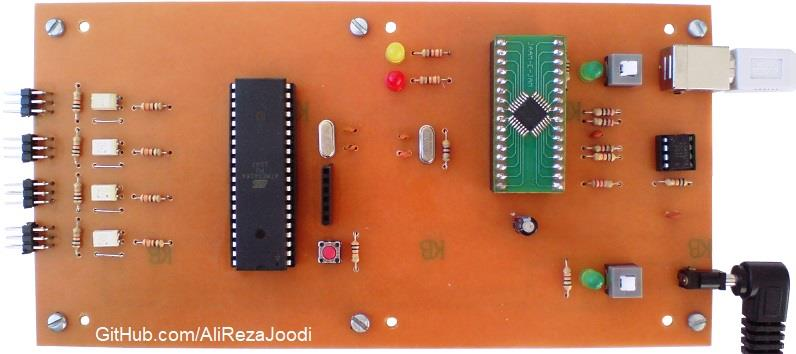
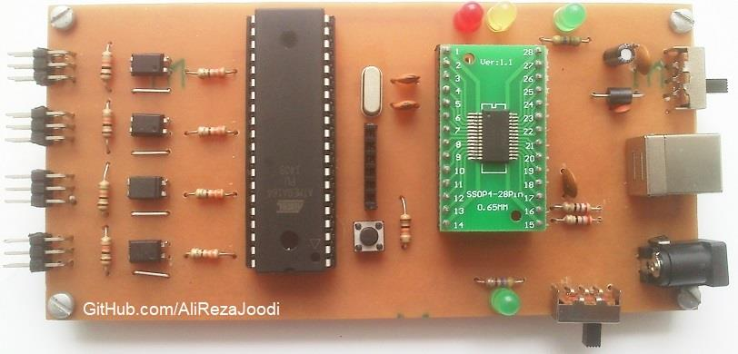
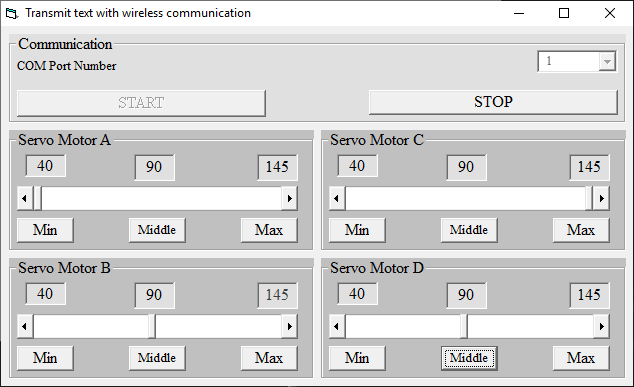
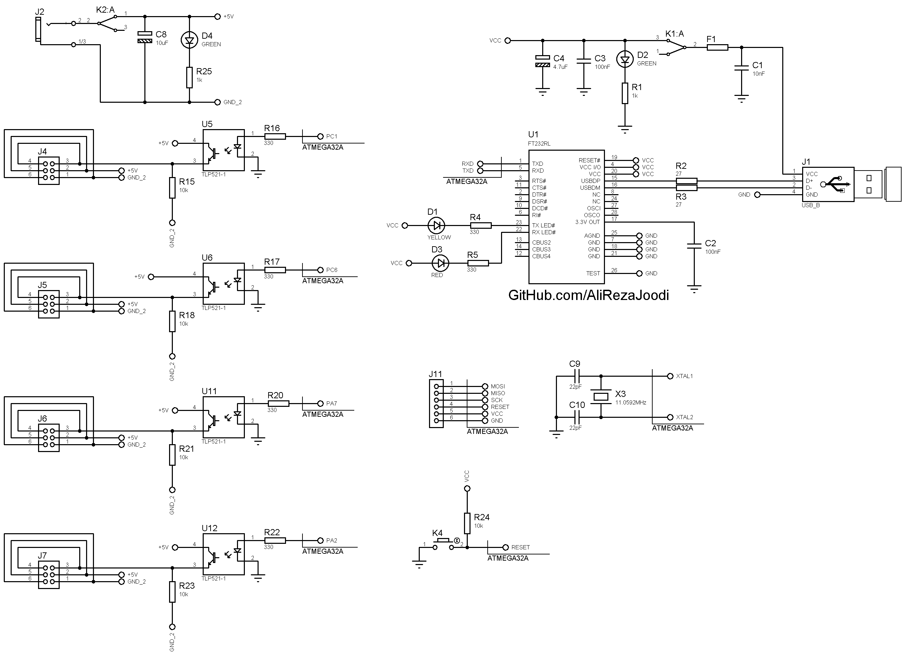

## Servo Motor Driver Controlled with Computer, 4 Motors, Optically Isolated, USB Interface
	   
MCU:			ATmega32A  
Frequency:     		11.059200MHz (External Crystal)  
Computer Interfacing:	UART to USB Converter with FT232BL  
Computer Interfacing:	UART to USB Converter with FT232RL  
Computer Software:	VB6  
Computer Software:	MATLAB   
Servo Motor:		4x  
Isolated:		TLP521  

Note: Included schematic and PCB layout with Proteus  
Note: It's a prototype and should get better

### Folder and Files Description
It has included:
- `Code_BascomAVR` (Code with Basic Language)
- `Code_Matlab` (Software with Matlab)
- `Code_VB6` (Software with Visual Basic)
- `Hardware_FT232BL` (Included hardware laye)
- `Hardware_FT232RL` (Included hardware laye)
- `Pictures` (Photos Samples Made)

### Picture, USB Controller with FT232BL: v1.0

### Picture, USB Controller with FT232RL: v1.0

### Software, VB6: v1.0

### Schematic, USB Controller with FT232RL: v1.0

### Schematic, USB Controller with FT232BL: v1.0

My GitHub Account: [GitHub.com/AliRezaJoodi](https://github.com/AliRezaJoodi)  
**Note**: [You can go here to download a single folder or file from GitHub.com](https://minhaskamal.github.io/DownGit/#/home)
