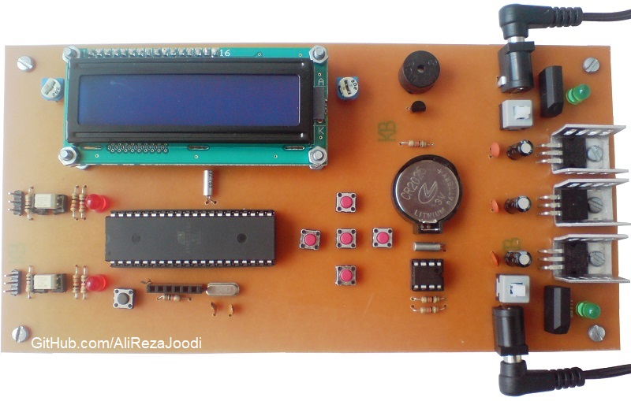
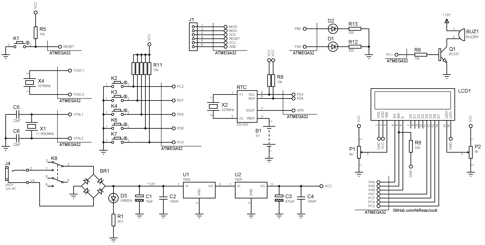

## 2-Channel Servo Motor Controller, Time Scheduled
Note: This is just a prototype and needs improvement. 

### Pictures
v1.0  

### Features
- **Motor Type:** 2 Servo Motors
- **Control Method:** Time Scheduled
- **Microcontroller:** ATmega32A
- **Display:** 16x2 Character LCD
- **Motor Driver Isolation:** TLP521 optocoupler for signal isolation
- **Timer Type:** External RTC, DS1307
- **Power Supply:** x2

### Folders and Files
This project includes:
- `Code_BascomAVR` — Microcontroller programmed in BASCOM-AVR (BASIC)
- `Hardware` — Schematic and PCB layout with Proteus
- `Pictures` — Project photos
- `Simulate` — Simulating the project with Proteus

### Schematic
v1.0  

### More Information
**Note**: [You can go here to download a single folder or file from GitHub.com](https://minhaskamal.github.io/DownGit/#/home)  
My GitHub Account: [GitHub.com/AliRezaJoodi](https://github.com/AliRezaJoodi)