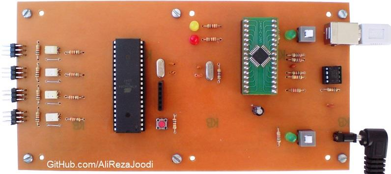
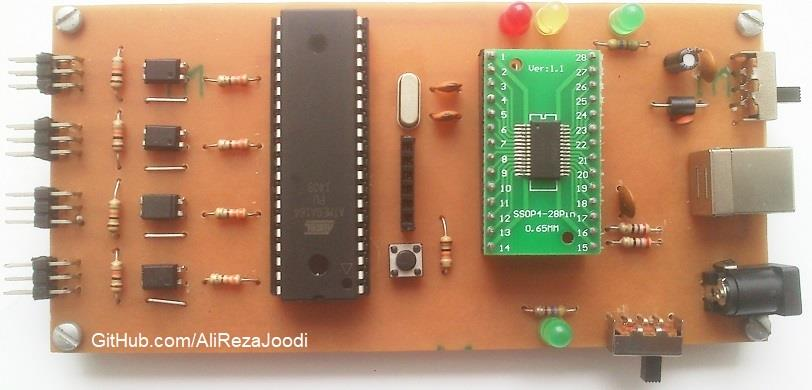
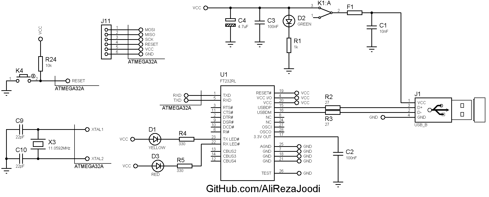
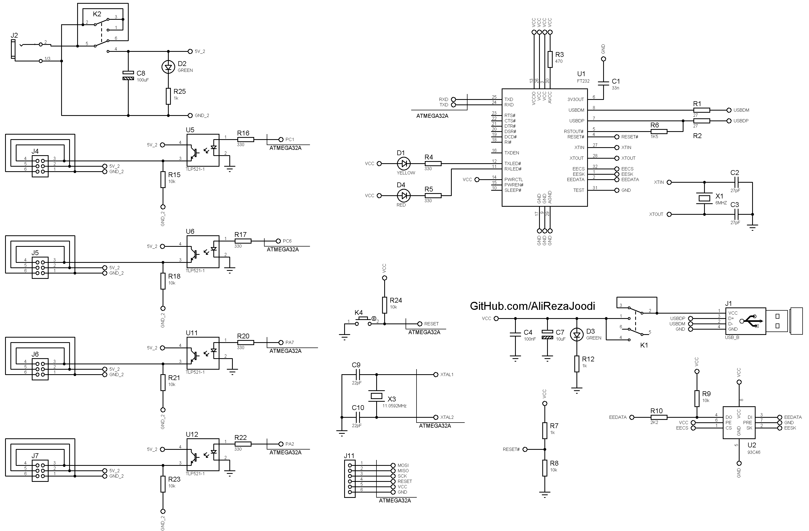

## 4-Channel Servo Motor Controller, Computer Controlled, USB Interface
Note: This is just a prototype and needs improvement. 

### Pictures
USB Controller with FT232BL: v1.0  

USB Controller with FT232RL: v1.0  

Software, VB6: v1.0  

### Features
- MCU: ATmega32A
- Computer Interfacing: UART to USB Converter with FT232BL
- Computer Interfacing: UART to USB Converter with FT232RL
- Isolated: Optocoupler TLP521
- Servo Motor: 4x

### Command Format 
Each command is made of a letter (device selector) and a number (control value).   
`XNNN`
- `X` = A, B, C, D and E
- `NNN` = number between 0 and 255

Examples:
- `A124` = Select servo 1, pulse value 124
- `B200` = Select servo 2, pulse value 200
- `C0` = Select servo 3, pulse value 0
- `D255` = Select servo 4, pulse value 255

### Folders and Files
This project includes:
- `Code_BascomAVR` _ Microcontroller Programming in BASCOM-AVR with Basic Language
- `Code_Matlab` _Software developed in Matlab
- `Code_VB6` _Software developed in Visual Basic (VB6)
- `Hardware_FT232BL` _ Included schematic and PCB layout with Proteus
- `Hardware_FT232RL` _ Included schematic and PCB layout with Proteus
- `Pictures` _ Sample Photos of Project

### Schematic
USB Controller with FT232RL: v1.0  

USB Controller with FT232BL: v1.0  

### More Information
**Note**: [You can go here to download a single folder or file from GitHub.com](https://minhaskamal.github.io/DownGit/#/home)  
My GitHub Account: [GitHub.com/AliRezaJoodi](https://github.com/AliRezaJoodi)