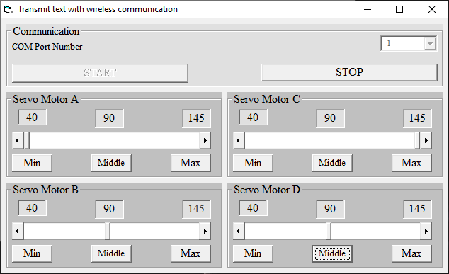

## 4-Channel Servo Motor Controller, Computer Controlled, USB Interface
Note: This is just a prototype and needs improvement. 

### Pictures
USB Controller with FT232BL: v1.0  

USB Controller with FT232RL: v1.0  

Software, VB6: v1.0  

### Features
- **Microcontroller:** ATmega32A
- **Computer Interface:** USB to UART converter, FT232BL
- **Computer Interface:** USB to UART converter, FT232RL
- **Isolation:** TLP521 optocoupler for signal isolation
- **Servo Motor:** 4x
- **Controller Power Supply:** USB powered  
- **Motor Power Supply:** External adapter

### Command Format 
Each command is made of a letter (device selector) and a number (control value).   
`XNNN`
- `X` = A, B, C, D and E
- `NNN` = number between 0 and 255

Examples:
- `A124` = Select servo 1, pulse value 124
- `B200` = Select servo 2, pulse value 200
- `C0` = Select servo 3, pulse value 0
- `D255` = Select servo 4, pulse value 255

### Folders and Files
This project includes:
- `Code_BascomAVR` — Microcontroller programmed in BASCOM-AVR (BASIC)
- `Code_Matlab` — Software developed in Matlab
- `Code_VB6` — Software developed in Visual Basic 6.0 (BASIC)
- `Hardware_FT232BL` — Schematic and PCB layout with Proteus
- `Hardware_FT232RL` — Schematic and PCB layout with Proteus
- `Pictures` — Project photos

### Schematic
Controller, USB to UART Converter, FT232RL: v1.0  

Controller, USB to UART Converter, FT232BL: v1.0  

Driver: v1.0  

### More Information
**Note**: [You can go here to download a single folder or file from GitHub.com](https://minhaskamal.github.io/DownGit/#/home)  
My GitHub Account: [GitHub.com/AliRezaJoodi](https://github.com/AliRezaJoodi)