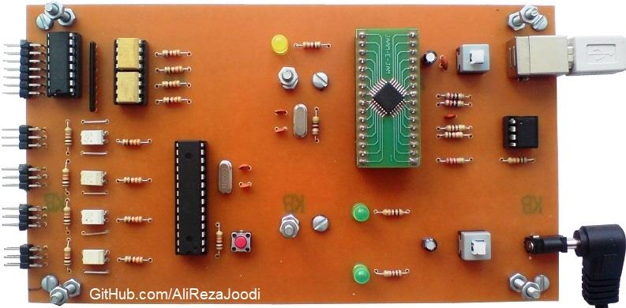
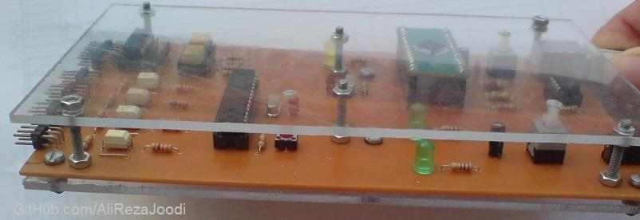
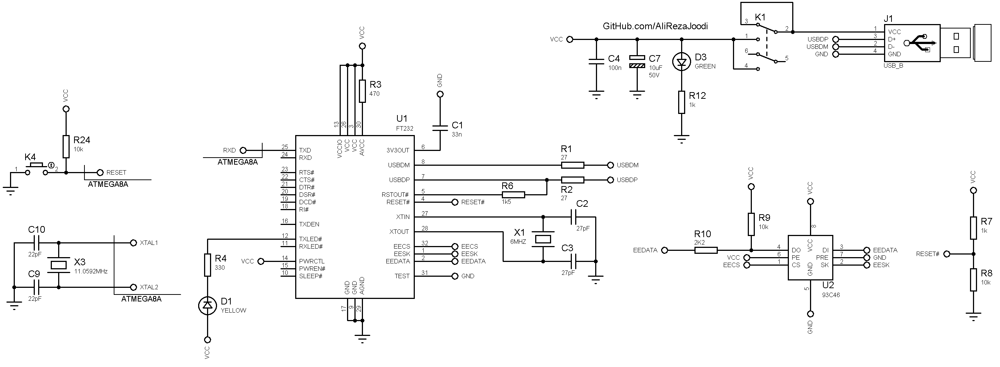
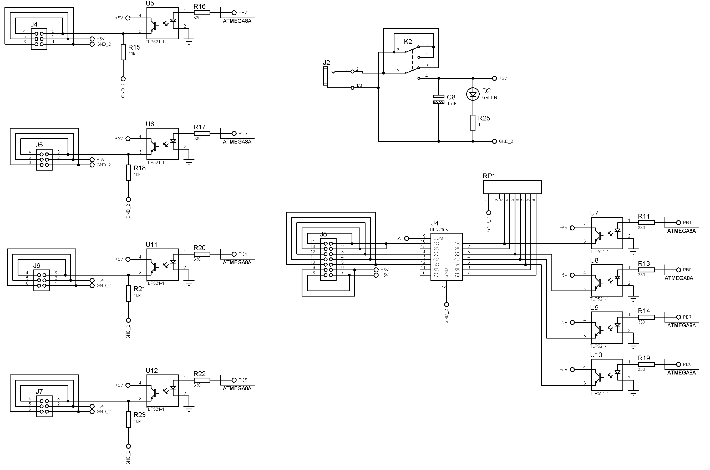

## 4-Channel Servo Motor Controller and Single Stepper Motor Driver, Computer Controlled, USB Interface
Note: This is just a prototype and needs improvement.

### Pictures
v1.0  

v1.0 with Box  

### Features
- **Motor Type 1:** 4 Servo Motors
- **Motor Type 2:** Single Unipolar Stepper Motor
- **Control Method:** Computer Controlled, USB Interface
- **Microcontroller:** ATmega8A
- **Computer Interface:** USB to UART converter, FT232BL
- **Motor Driver Isolation:** TLP521 optocoupler for signal isolation
- **Power Supply for Controller:** USB powered  
- **Power Supply for Motor:** External adapter 

### Command Format
Each command is made of a letter (device selector) and a number (control value).   
`XNNN`
- `X` = A, B, C, D and E
- `NNN` = number between 0 and 255

Examples:
- `A124` = Select servo 1, pulse value 124
- `B200` = Select servo 2, pulse value 200
- `C0` = Select servo 3, pulse value 0
- `D255` = Select servo 4, pulse value 255
- `E8` = Select stepper motor, output is 1000

Note: The number is converted to 4-bit binary and sent to 4 stepper motor pins:  
Example:
- `E8` = 1000
- `E3` = 0011

### Folders and Files
This project includes:
- `Code_BascomAVR` — Microcontroller programmed in BASCOM-AVR (BASIC)
- `Code_Matlab` — Software developed in Matlab
- `Hardware` — Schematic and PCB layout with Proteus
- `Pictures` — Project photos

### Schematic
v1.0, Main  

v1.0, Driver  

My GitHub Account: [GitHub.com/AliRezaJoodi](https://github.com/AliRezaJoodi)  
**Note**: [You can go here to download a single folder or file from GitHub.com](https://minhaskamal.github.io/DownGit/#/home)
