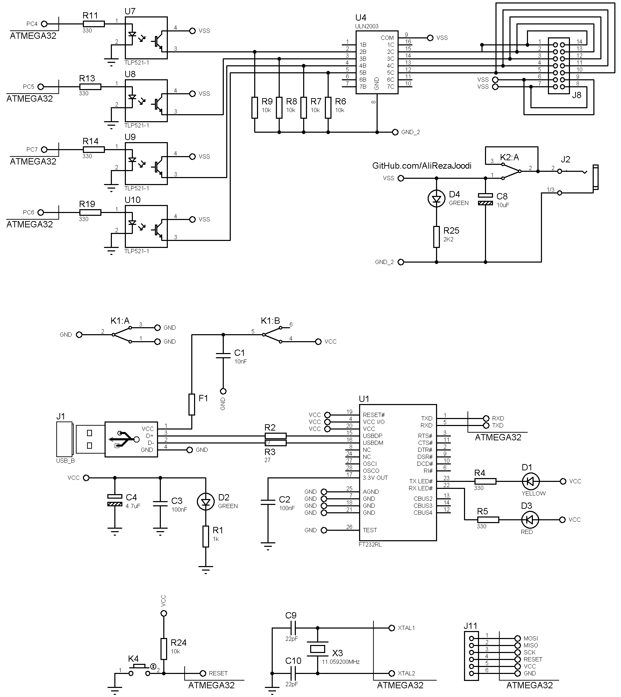
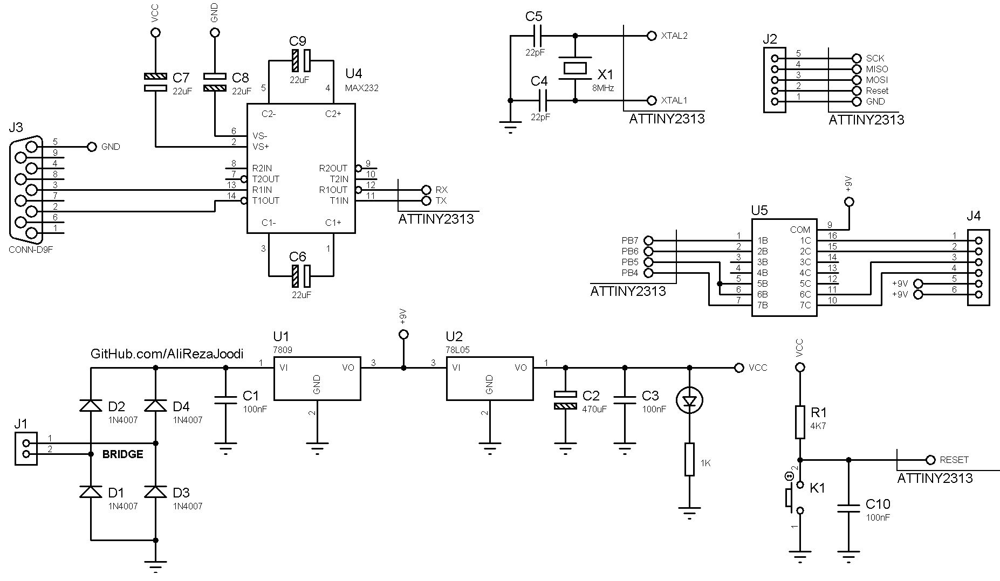

## Single Stepper Motor Driver, Computer Controlled
Note: This is just a prototype and needs improvement.  
Note: The project was developed in 5 models.  

### Pictures
Model 5: USB, FT232RL, v1.0  

Model 4: USB, FT232BL, v1.0  

Model 3: USB, RS232, IRF540, v1.0  

Model 2: RS232, v1.0  

Model 1: RS232, ATtiny2313, v1.0  

### Features
- **Motor Type:** Unipolar Stepper Motors x1
- **Microcontroller:** ATmega32A
- **Control Method:** Computer Controlled
- **Computer Interface in Model 1,2 and 3:** RS232 to UART converter, MAX232
- **Computer Interface in Model 4:** USB to UART converter, FT232BL
- **Computer Interface in Model 5:** USB to UART converter, FT232RL
- **Motor Driver in Model 1,2,4 and 5:** ULN2003
- **Motor Driver in Model 3:** MOSFET based driver, IRF540
- **Power Supply in Model 1 and 2:** External adapter x1
- **Power Supply in Model 3:** External adapter x2
- **Power Supply in Model 4 and 5:** USB powered and External adapter x1

### Folders and Files
This project includes:
- `Code_BascomAVR` — Microcontroller programmed in BASCOM-AVR (BASIC)
- `Code_CodeVisionAVR` — Microcontroller programmed in CodeVisionAVR (C)
- `Code_Matlab` — Software developed in Matlab
- `Hardware` — Schematic and PCB layout with Proteus
- `Pictures` — Project photos
- `Simulate` — Simulating the project with Proteus

### Schematic
Model 5: USB, FT232RL, v1.0  

Model 4: USB, FT232BL, v1.0  

Model 3: USB, RS232, IRF540, v1.0  

Model 2: RS232, v1.0  

Model 1: RS232, ATtiny2313, v1.0  

### More Information
**Note**: [You can go here to download a single folder or file from GitHub.com](https://minhaskamal.github.io/DownGit/#/home)  
My GitHub Account: [GitHub.com/AliRezaJoodi](https://github.com/AliRezaJoodi) 