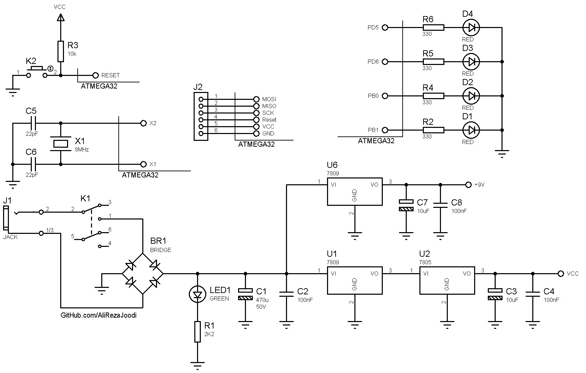

## 4 Stepper Motors Driver, Code Controlled
Note: This is just a prototype and needs improvement.

### Pictures
v1.0  

### Features
- **Motor Type:** 4 Unipolar Stepper Motors
- **Control Method:** Code Controlled
- **Microcontroller:** ATmega32A
- **Motor Driver:** ULN2803 x2
- **Power Supply:** x1

### Folders and Files
This project includes:
- `Code_BascomAVR` — Microcontroller programmed in BASCOM-AVR (BASIC)
- `Hardware` — Schematic and PCB layout with Proteus
- `Pictures` — Project photos
- `Simulate` — Simulating the project with Proteus

### Schematic
v1.0, Main  

v1.0, Driver  

My GitHub Account: [GitHub.com/AliRezaJoodi](https://github.com/AliRezaJoodi)  
**Note**: [You can go here to download a single folder or file from GitHub.com](https://minhaskamal.github.io/DownGit/#/home)
