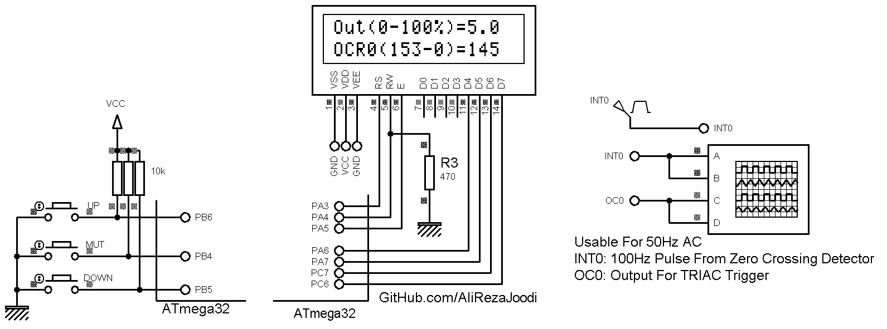

## Phase Dimmer, 1-Phase, Based On AVR MCU, With Zero-Crossing Synchronized PWM
 
MCU:        	ATmega32  
Frequency:  	4MHz 
Timer0:		PWM Mode with inverted output  
External INT0:	Rising Edge Mode  
Display: 	16x2 LCD  
	
Note: INT0 used for end to the timer0 task  
Note: Used of a MOC3021 for TRIAC gate driver  

It's a personal project.  
Date in Jul 2023 

### Pictures: v1.x

Schematic For Zero Crossing Detector:
  
[Link For 1-Phase Zero Crossing Detector](https://github.com/AliRezaJoodi/Electronics_Modules/tree/main/Detector_ZeroCrossing_1Phase) 

Schematic For Triac Gate Driver With MOC3021:
  
[Link For Triac Gate Driver With MOC30xx](https://github.com/AliRezaJoodi/Electronics_Modules/tree/main/Driver_TRIAC_MOC30xx) 

### Folder and Files Description
It has included:
- `Code_CodeVisionAVR` (Code with C Language)
- `Pictures` (Photos Samples Made)
- `Simulate` (Simulator File)

### Simulate: v1.0

### Video: v1.x
[Youtube.com/@AliRezaJoodi](https://www.youtube.com/watch?v=y4R41ittZcE) 

My GitHub Account: [GitHub.com/AliRezaJoodi](https://github.com/AliRezaJoodi)  
**Note**: [You can go here to download a single folder or file from GitHub.com](https://minhaskamal.github.io/DownGit/#/home)
