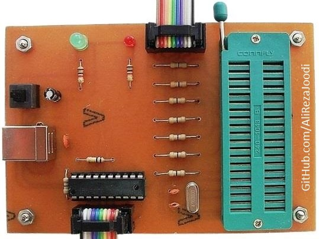
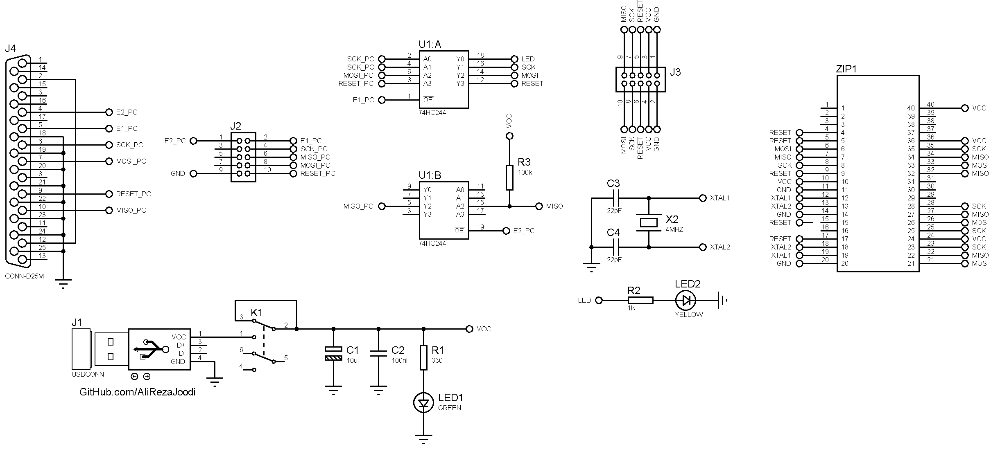

## STK200/300 ISP Programmer For AVR Microcontrollers   
 
Note: Included schematic and PCB layout with Proteus  

### Folder and Files Description
It has included:
- `Hardware` (Included hardware laye)
- `Pictures` (Photos Samples Made)

### Pictures: v2.1

### Schematic: v2.2

My GitHub Account: [GitHub.com/AliRezaJoodi](https://github.com/AliRezaJoodi)  
**Note**: [You can go here to download a single folder or file from GitHub.com](https://minhaskamal.github.io/DownGit/#/home)
