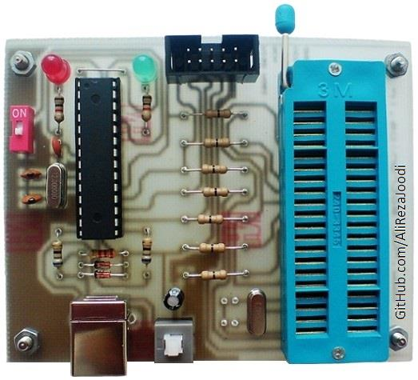
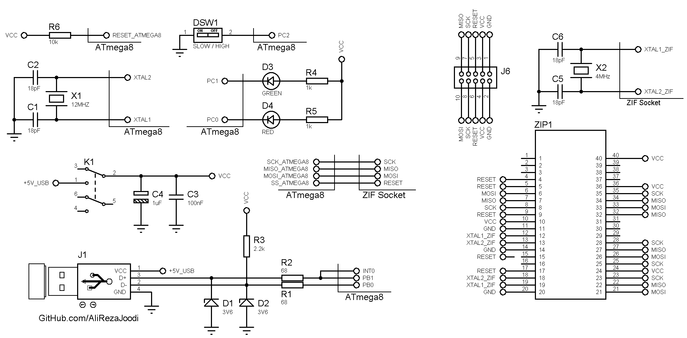

## USBASP Programmer For AVR Microcontrollers
 
Note: Included schematic and PCB layout with Proteus  
Note: It use of a ATmega8 that drive with external crystal. So, after flash programming change fuse bits to external crystal.
Note: Please use of `ProgISP` software for programming 

### Folder and Files Description
It has included:
- `Hardware` (Included hardware laye)
- `HEX` (The HEX file to write into the microcontroller)
- `Pictures` (Photos Samples Made)
- `WindowsDriver` (Windows Driver files)

### Pictures: v1.0

### Schematic: v1.0

My GitHub Account: [GitHub.com/AliRezaJoodi](https://github.com/AliRezaJoodi)  
**Note**: [You can go here to download a single folder or file from GitHub.com](https://minhaskamal.github.io/DownGit/#/home)
