## AVR Microcontroller Projects
I'm uploading my personal projects on the repository.  
  
Note: The projects are prototype and should get better.  

### Gallery of the Repository
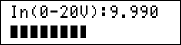

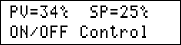
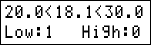
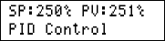
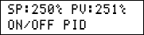

### Table of Contents
|Picture|Title|Bascom|CodeVision|mikroC|
|:------|:----|:----:|:--------:|:----:|
|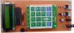|[Calculator_LCD](Calculator_LCD)|Y|Y|-|
||[Clock&Date_InternalTimer](Clock&Date_InternalTimer)|Y|-|
||[Clock_InternalTimer_7SegmentDisplay](Clock_InternalTimer_7SegmentDisplay)|-|Y|
||[ControlSystems_OnOff](ControlSystems_OnOff)|-|Y|
||[ControlSystems_PID](ControlSystems_PID)|-|Y|
||[ControlSystems_PID-OnOFF](ControlSystems_PID-OnOFF)|-|Y|
||[Counter_2Digit_7SegmentDisplay](Counter_2Digit_7SegmentDisplay)|Y|-|
|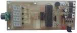|[DigitalMeter_Ultrasonic_SRF02_7Segment](DigitalMeter_Ultrasonic_SRF02_7Segment)|Y|-|-|
|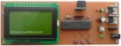|[DigitalMeter_Ultrasonic_SRF02_GLCD](DigitalMeter_Ultrasonic_SRF02_GLCD)|Y|-|-|
|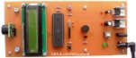|[DigitalMeter_Ultrasonic_SRF02_LCD](DigitalMeter_Ultrasonic_SRF02_LCD)|Y|Y|Y|
|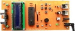|[DigitalMeter_Ultrasonic_SRF05_LCD](DigitalMeter_Ultrasonic_SRF05_LCD)|Y|-|-|
|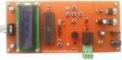|[DigitalWaterLevelMeter_Ultrasonic_SRF05_LCD](DigitalWaterLevelMeter_Ultrasonic_SRF05_LCD)|Y|-|
||[Programer_STK200](Programer_STK200)|X|X|X|
|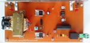|[RelayController_LaserPointer_1CH_ATmega8](RelayController_LaserPointer_1CH_ATmega8)|Y|Y|
||[RelayController_LaserPointer_1CH_ATtiny13](RelayController_LaserPointer_1CH_ATtiny13)|Y|Y|
|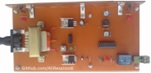|[RelayController_LaserPointer_1CH_ATtiny26](RelayController_LaserPointer_1CH_ATtiny26)|Y|Y|
||[RelayController_LaserPointer_1CH_ATtiny2313](RelayController_LaserPointer_1CH_ATtiny2313)|Y|Y|
|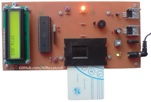|[TelCardReader](TelCardReader)|Y|Y|
||[TextDisplay_Keyboard](TextDisplay_Keyboard)|Y|Y|
|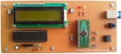|[TextDisplay_USB](TextDisplay_USB)|Y|Y|
||[Thermometer_2Alarm](Thermometer_2Alarm)|Y|-|
|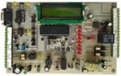|[TrainingBoard_Dimmer](TrainingBoard_Dimmer)|X|X|X|
|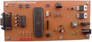|[TrainingBoard_IR](TrainingBoard_IR)|X|X|X|
||[Voltmeter_DC20V_BarGraph](Voltmeter_DC20V_BarGraph)|Y|-|
|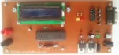|[Voltmeter_DC5V_RS232](Voltmeter_DC5V_RS232)|Y|-|-|
