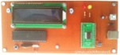

## AVR Microcontroller Projects
I'm uploading my personal projects on the repository.

### Gallery of the Repository

### Table of Contents
|Title|BascomAVR|CodeVisionAVR|mikroC PRO for AVR|
|:----|:-------:|:-----------:|:----------------:|
|[Clock&Date_InternalTimer](Clock&Date_InternalTimer)|Y|-|
|[Clock_InternalTimer_7SegmentDisplay](Clock_InternalTimer_7SegmentDisplay)|-|Y|
|[ControlSystems_OnOff](ControlSystems_OnOff)|-|Y|
|[ControlSystems_PID](ControlSystems_PID)|-|Y|
|[ControlSystems_PID-OnOFF](ControlSystems_PID-OnOFF)|-|Y|
|[Counter_2Digit_7SegmentDisplay](Counter_2Digit_7SegmentDisplay)|Y|-|
|[DigitalMeter_Ultrasonic_SRF02_LCD](DigitalMeter_Ultrasonic_SRF02_LCD)|Y|Y|Y|
|[RelayController_LaserPointer_1CH_ATmega8](RelayController_LaserPointer_1CH_ATmega8)|Y|Y|
|[RelayController_LaserPointer_1CH_ATtiny13](RelayController_LaserPointer_1CH_ATtiny13)|Y|Y|
|[RelayController_LaserPointer_1CH_ATtiny26](RelayController_LaserPointer_1CH_ATtiny26)|Y|Y|
|[RelayController_LaserPointer_1CH_ATtiny2313](RelayController_LaserPointer_1CH_ATtiny2313)|Y|Y|
|[TelCardReader](TelCardReader)|Y|Y|
|[TextDisplay_Keyboard](TextDisplay_Keyboard)|Y|Y|
|[TextDisplay_USB](TextDisplay_USB)|Y|Y|
|[Thermometer_2Alarm](Thermometer_2Alarm)|Y|-|
|[Voltmeter_20V_BarGraphDisplay](Voltmeter_20V_BarGraphDisplay)|Y|-|
