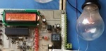

## AVR Microcontroller Projects
I'm uploading my personal projects on the repository.  
Note: The projects are prototype and should get better.  

1: Bascom AVR  
2: CodeVision AVR  
3: mikroC PRO for AVR  

### Table of Contents
|Picture|Title|1|2|3|
|:------|:----|:----:|:----:|:----:|
||[Calculator with LCD Display](Calculator_LCD)|Y|Y|-|
||[Clock With DS1307 RTC, Thermometer And Voltmeter On LCD Display](ClockWithDS1307&Thermometer&Voltmeter_LCD)|Y|-|-|
||[Clock With DS1307 RTC And Thermometer On LCD Display](ClockWithDS1307&Thermometer_LCD)|Y|-|-|
||[Clock With Internal Timer And Thermometer On LCD Display](ClockWithTimer2&Thermometer_LCD)|Y|-|-|
||[Clock With Timer2 On 7Segment Display](ClockWithTimer2_7Segment)|Y|Y|-|
||[Conference Timer With ATmega8 AVR MCU](ConferenceTimer_7Segment_ATmega8)|Y|-|-|
||[Conference Timer With ATmega32 AVR MCU](ConferenceTimer_7Segment_ATmega32)|Y|-|-|
||[Counter_2Digit_7SegmentDisplay](Counter_2Digit_7SegmentDisplay)|Y|-|-|
||[Digital Meter With SRF02 Ultrasonic Module And 7 Segments Display](DigitalMeterWithUltrasonicMoudle_SRF02_7Segment)|Y|-|-|
||[Digital Meter With SRF02 Ultrasonic Module And GLCD Display](DigitalMeterWithUltrasonicMoudle_SRF02_GLCD)|Y|-|-|
||[Digital Meter With SRF02 Ultrasonic Moudle And LCD Display](DigitalMeterWithUltrasonicMoudle_SRF02_LCD)|Y|Y|Y|
||[Digital Meter With SRF05 Ultrasonic Moudle And LCD Display](DigitalMeterWithUltrasonicMoudle_SRF05_LCD)|Y|-|-|
||[Digital Water Level Meter With SRF05 Ultrasonic Moudle And LCD Display](DigitalWaterLevelMeterWithUltrasonicMoudle_SRF05_LCD)|Y|-|-|
||[Single Phase Dimmer with LCD Display](Dimmer_1Phase_LCD)|-|Y|-|
||[16CH Flashing Light with Triacs](FlasherWithTriacs_16CH)|Y|-|-|
||[Line Follower Robot](LineFollowerRobot)|Y|Y|-|
||[STK200/STK300 Programer](Programer_STK200)|X|X|X|
||[USBASP Programer](Programer_USBASP)|X|X|X|
||[1CH Relay Controller with Laser Pointer And ATmega8 AVR MCU](RelayControllerWithLaserPointer_1CH_ATmega8)|Y|Y|-|
||[1CH Relay Controller with Laser Pointer And ATtiny13 AVR MCU](RelayControllerWithLaserPointer_1CH_ATtiny13)|Y|Y|-|
||[1CH Relay Controller with Laser Pointer And ATtiny26 AVR MCU](RelayControllerWithLaserPointer_1CH_ATtiny26)|Y|Y|-|
||[1CH Relay Controller with Laser Pointer And ATtiny2313 AVR MCU](RelayControllerWithLaserPointer_1CH_ATtiny2313)|Y|Y|-|
||[Smart Parking Simulator](SmartParkingSimulator)|Y|-|-|
||[Tel Card Reader](TelCardReader)|Y|Y|-|
||[Text Display With PS2 Keyboard Controlled](TextDisplayWithPcKeyboardControlled_LCD)|Y|Y|-|
||[Text Display With Computer Controlled](TextDisplayWithComputerControlled_LCD)|Y|Y|-|
||[Thermometer_2Alarm](Thermometer_2Alarm)|Y|-|-|
||[AVR Training Board Exclusive For Dimmer](TrainingBoardExclusiveForDimmer)|X|X|X|
||[AVR Training Board Exclusive For IR Remote Send And Receive](TrainingBoardExclusiveForIR)|X|X|X|
||[Voltmeter With BarGraph On LCD For 0-20V/DC](VoltmeterWithBarGraph_DC20V_LCD)|Y|-|-|
||[Voltmeter With Computer Monitoring And LCD Display For 0-5V/DC](VoltmeterWithComputerMonitoring_DC5V_LCD)|Y|-|-|
