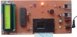

## AVR Microcontroller Projects
I'm uploading my personal projects on the repository.  
  
Note: The projects are prototype and should get better.  

### Gallery of the Repository

1: Bascom AVR  
2: CodeVision AVR  
3: mikroC PRO for AVR  

### Table of Contents
|Picture|Title|1|2|3|
|:------|:----|:----:|:--------:|:----:|
||[Calculator with LCD Display](Calculator_LCD)|Y|Y|-|
||[Clock&Date_InternalTimer](Clock&Date_InternalTimer)|Y|-|
||[Clock_InternalTimer_7SegmentDisplay](Clock_InternalTimer_7SegmentDisplay)|-|Y|
||[ControlSystems_OnOff](ControlSystems_OnOff)|-|Y|
||[ControlSystems_PID](ControlSystems_PID)|-|Y|
||[ControlSystems_PID-OnOFF](ControlSystems_PID-OnOFF)|-|Y|
||[Counter_2Digit_7SegmentDisplay](Counter_2Digit_7SegmentDisplay)|Y|-|
||[Digital Meter With SRF02 Ultrasonic Module And 7 Segments Display](DigitalMeter_Ultrasonic_SRF02_7Segment)|Y|-|-|
||[Digital Meter With SRF02 Ultrasonic Module And GLCD Display](DigitalMeter_Ultrasonic_SRF02_GLCD)|Y|-|-|
||[Digital Meter With SRF02 Ultrasonic Moudle And LCD Display](DigitalMeter_Ultrasonic_SRF02_LCD)|Y|Y|Y|
||[Digital Meter With SRF05 Ultrasonic Moudle And LCD Display](DigitalMeter_Ultrasonic_SRF05_LCD)|Y|-|-|
||[Digital Water Level Meter With SRF05 Ultrasonic Moudle And LCD Display](DigitalWaterLevelMeter_Ultrasonic_SRF05_LCD)|Y|-|
||[STK200/STK300 Programer](Programer_STK200)|X|X|X|
||[USBASP Programer](Programer_USBASP)|X|X|X|
||[1CH Relay Controller with Laser Pointer And ATmega8 AVR MicroController](RelayController_LaserPointer_1CH_ATmega8)|Y|Y|
||[1CH Relay Controller with Laser Pointer And ATtiny13 AVR MicroController](RelayController_LaserPointer_1CH_ATtiny13)|Y|Y|
||[1CH Relay Controller with Laser Pointer And ATtiny26 AVR MicroController](RelayController_LaserPointer_1CH_ATtiny26)|Y|Y|
||[1CH Relay Controller with Laser Pointer And ATtiny2313 AVR MicroController](RelayController_LaserPointer_1CH_ATtiny2313)|Y|Y|
||[Tel Card Reader](TelCardReader)|Y|Y|
||[Text Control On The LCD With A PS2 Keyboard](TextDisplay_Keyboard)|Y|Y|
||[Text Control On The LCD With A Computer](TextDisplay_USB)|Y|Y|
||[Thermometer_2Alarm](Thermometer_2Alarm)|Y|-|
||[AVR Training Board Exclusive For Dimmer](TrainingBoard_Dimmer)|X|X|X|
||[AVR Training Board Exclusive For IR Exercises](TrainingBoard_IR)|X|X|X|
||[Voltmeter_DC20V_BarGraph](Voltmeter_DC20V_BarGraph)|Y|-|
||[Accurate Voltmeter With LCD Display And Computer Monitoring](Voltmeter_DC5V_RS232)|Y|-|-|
