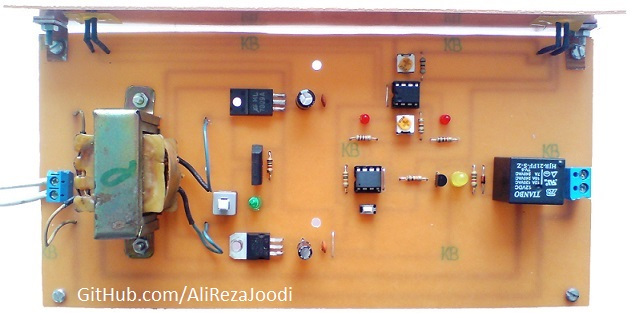
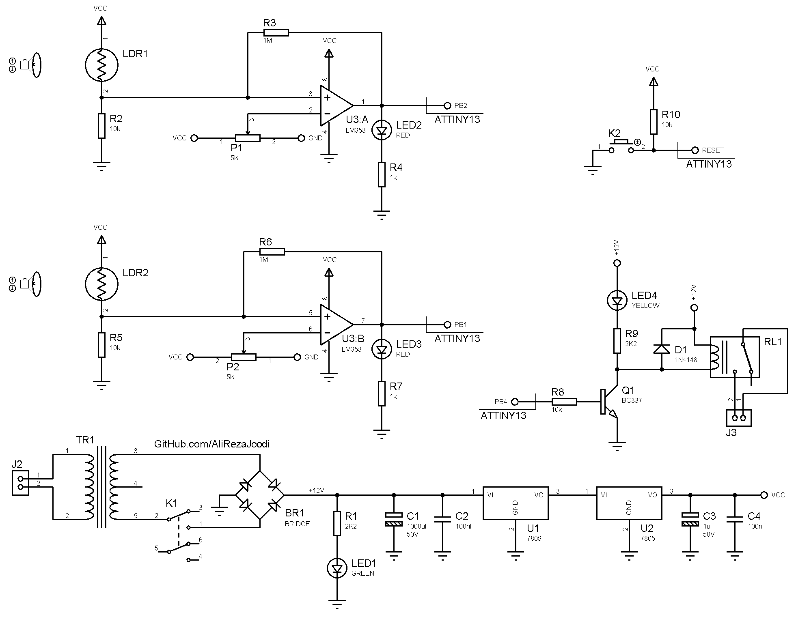

## 1CH Relay Controller with Laser Pointer And ATtiny13 AVR MicroController
There are one relay and two LDR sensors. One of them activates the relay and the other deactivates it.  

MCU:			ATtiny13    
Frequency:     		4.8MHz

Note: Included schematic and PCB layout with Proteus  
Note: It's a easy project with AVR and was a prototype. Although this made using microcontroller but, it could be done with logic gates.  

### Folder and Files Description
It has included:
- `Code_BascomAVR` (Code with Basic Language)
- `Code_CodeVisionAVR` (Code with C Language)
- `Hardware` (Included hardware layers)
- `Pictures` (Photos Samples Made)
- `Simulate` (Simulator File)

### Pictures: v1.0

### Schematic: v1.0

### Simulate: v1.0

My GitHub Account: [GitHub.com/AliRezaJoodi](https://github.com/AliRezaJoodi)  
**Note**: [You can go here to download a single folder or file from GitHub.com](https://minhaskamal.github.io/DownGit/#/home)
