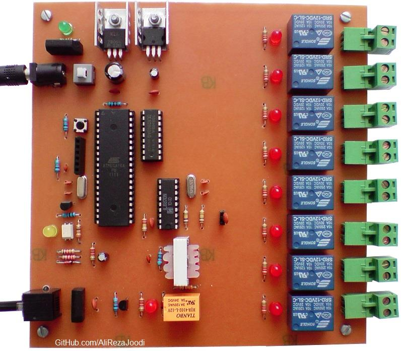

## Relay Remote Controller, DialTone, 8CH
Note: This is just a prototype and needs improvement.   

### Photo
v1.0  

### Features
- **Output Type:** Relay x8
- **Relay Driver:** ULN2803
- **Control Method:** Remote Controlled, DialTone
- **DTMF Decoder:** MT8870
- **Microcontroller:** ATmega32A
- **Power Supply:** x1

### Folders
- `Code_BascomAVR` — Microcontroller programmed in BASCOM-AVR (BASIC)
- `Hardware` — Schematic and PCB layout with Proteus
- `Pictures` — Project photos

### Schematic
v2.0  

### More Information
**Note**: [You can go here to download a single folder or file from GitHub.com](https://minhaskamal.github.io/DownGit/#/home)  
My GitHub Account: [GitHub.com/AliRezaJoodi](https://github.com/AliRezaJoodi)  
