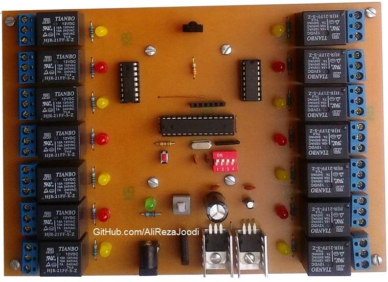
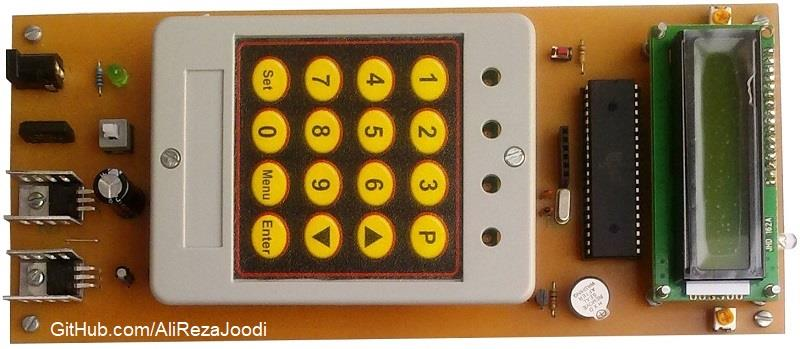
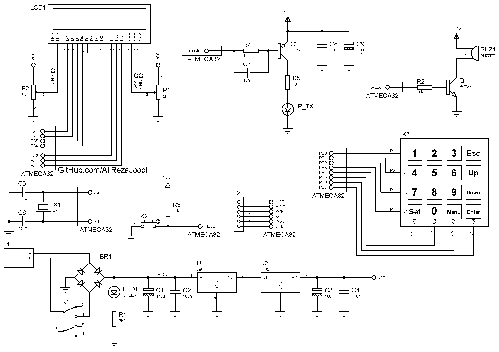

## Relay Remote Controller, IR, 210CH
Note: This is just a prototype and needs improvement.  
Note: The current firmware supports RC5 remotes only.  

This board controls 210 relays with infrared.
It has a 14-channel receiver with 4-bit addressing, so up to 15 boards can work together.
The transmitter uses a keyboard to select the device address and relay number, then sends the signal

### Pictures
Receiver, v1.0:  

Transmitter, v1.0:  

### Features
- **Output Type:** Relay
- **Control Method:** Remote Controlled, IR, RC5
- **Relay Driver:** ULN2803
- **Microcontroller:** ATmega32A and ATmega8A
- **Power Supply:** x2	

### Folders and Files
This project includes:
- `Code_BascomAVR` — Microcontroller programmed in BASCOM-AVR (BASIC)
- `Hardware` — Schematic and PCB layout with Proteus
- `Pictures` — Project photos

### Schematic
Receiver, v1.0:  

Transmitter, v1.0:  

### More Information
**Note**: [You can go here to download a single folder or file from GitHub.com](https://minhaskamal.github.io/DownGit/#/home)  
My GitHub Account: [GitHub.com/AliRezaJoodi](https://github.com/AliRezaJoodi)  
