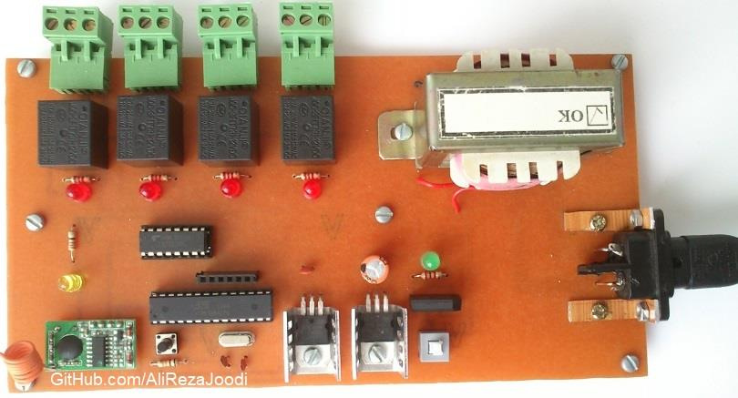

## Relay Remote Controller, RF, FSK, 4CH
Note: This is just a prototype and needs improvement.  

### Pictures
Receiver: Model2, v1.0:  

Receiver: Model1, v1.0:  

Transmitter: v2.0:  

### Features
- **Output Type:** Relay x4
- **Relay Driver:** ULN2003
- **Control Method:** Remote Controlled, RF, FSK
- **Microcontroller:** ATmega8A
- **Power Supply in Model 1 of Receiver:** Adapter x1	
- **Power Supply in Model 2 of Receiver:** Transformer x1
- **Power Supply in Transmitter:** Battery x1

### Folders and Files
This project includes:
- `Code_BascomAVR` — Microcontroller programmed in BASCOM-AVR (BASIC)
- `Hardware` — Schematic and PCB layout with Proteus
- `Pictures` — Project photos

### Schematic
Receiver: Model2, v1.0:  

Receiver: Model1, v1.1:  

Transmitter: v2.0:  

### More Information
**Note**: [You can go here to download a single folder or file from GitHub.com](https://minhaskamal.github.io/DownGit/#/home)  
My GitHub Account: [GitHub.com/AliRezaJoodi](https://github.com/AliRezaJoodi)  
