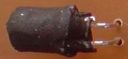
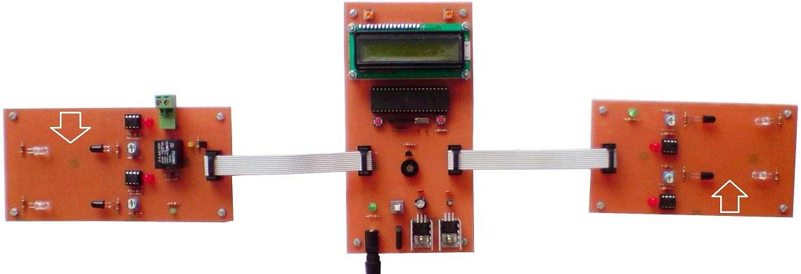
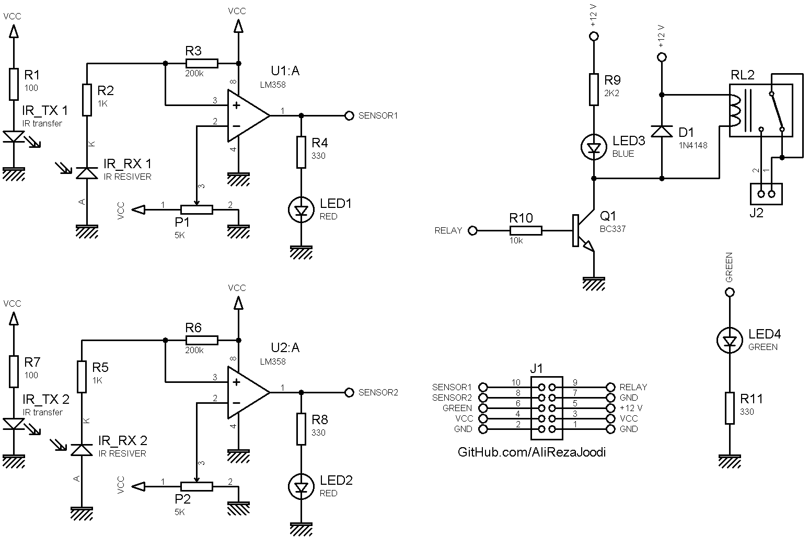
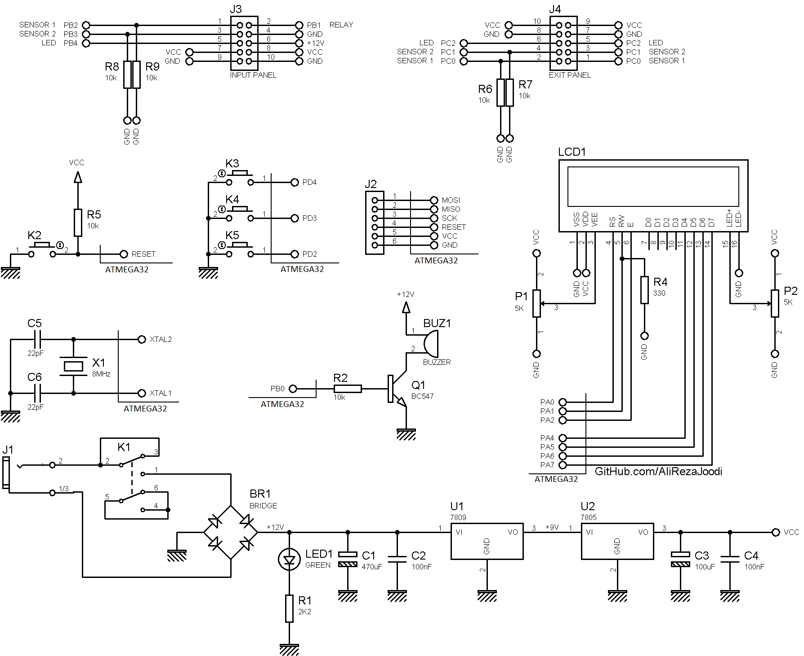
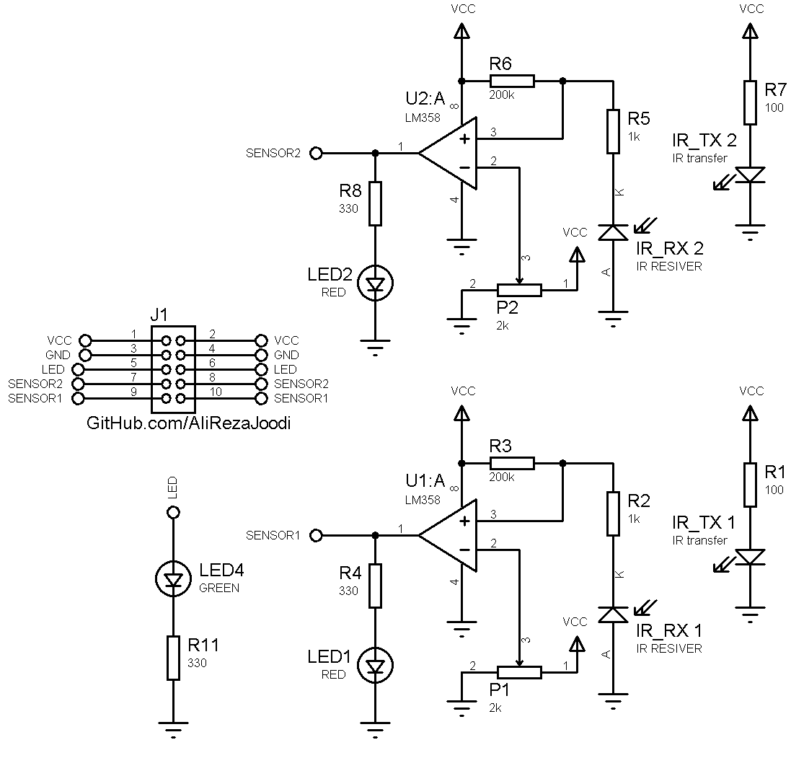
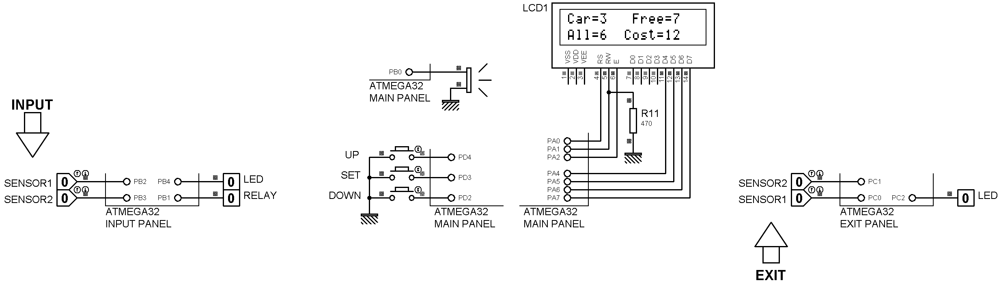

## Smart Parking Simulator 	   

MCU:		ATmega32A  
Frequency:     	8MHz    
Display:        16x2 LCD  

Note: IR receiver sensor need to a cover  

Note: Included schematic and PCB layout with Proteus  
Note: It's a prototype and should get better 

### Folder and Files Description
It has included:
- `Code_BascomAVR` (Code with Basic Language)
- `Code_CodeVisionAVR` (Code with C Language, This code is editing)
- `Hardware` (Included hardware laye
- `Pictures` (Photos Samples Made)
- `Simulate` (Simulator File)

### Pictures: v1.0

### Input Panel Schematic: v1.0

### Main Board Schematic: v1.0

### Exit Panel Schematic: v1.0

### Simulate: v1.0

My GitHub Account: [GitHub.com/AliRezaJoodi](https://github.com/AliRezaJoodi)  
**Note**: [You can go here to download a single folder or file from GitHub.com](https://minhaskamal.github.io/DownGit/#/home)
