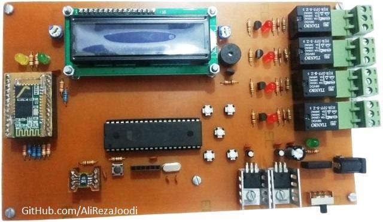
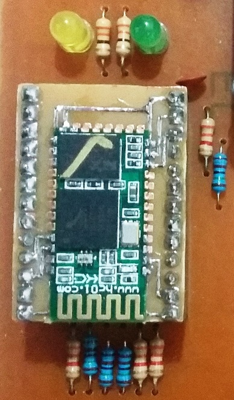

## Temperature and Humidity Controller with Bluetooth Computer Monitoring

MCU:        		ATmega32  
Sensor:     		SHT10
Bluetooth Module:	HC-05  
Display:    		16x2 Character LCD  
Output:			Relay	x4  
Computer Software:	VB6  

Note: Included schematic and PCB layout with Proteus.  
Note: It's a prototype and should get better.  

### Folder and Files Description
It has included:
- `Code_BascomAVR` (Code with Basic Language)
- `Code_VB6` (Software with Visual Basic)
- `Hardware` (Included hardware laye)
- `Pictures` (Photos Samples Made)

### Pictures: v1.0

### More Pictures:
  
  

My GitHub Account: [GitHub.com/AliRezaJoodi](https://github.com/AliRezaJoodi)  
**Note**: [You can go here to download a single folder or file from GitHub.com](https://minhaskamal.github.io/DownGit/#/home)
